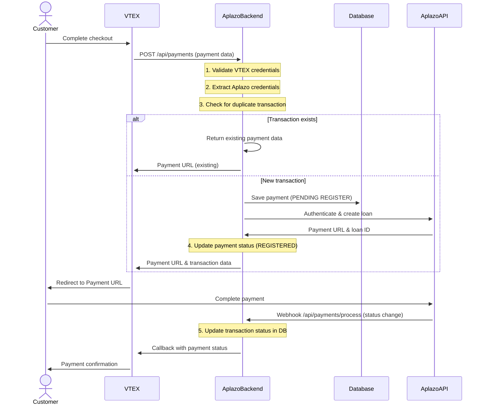
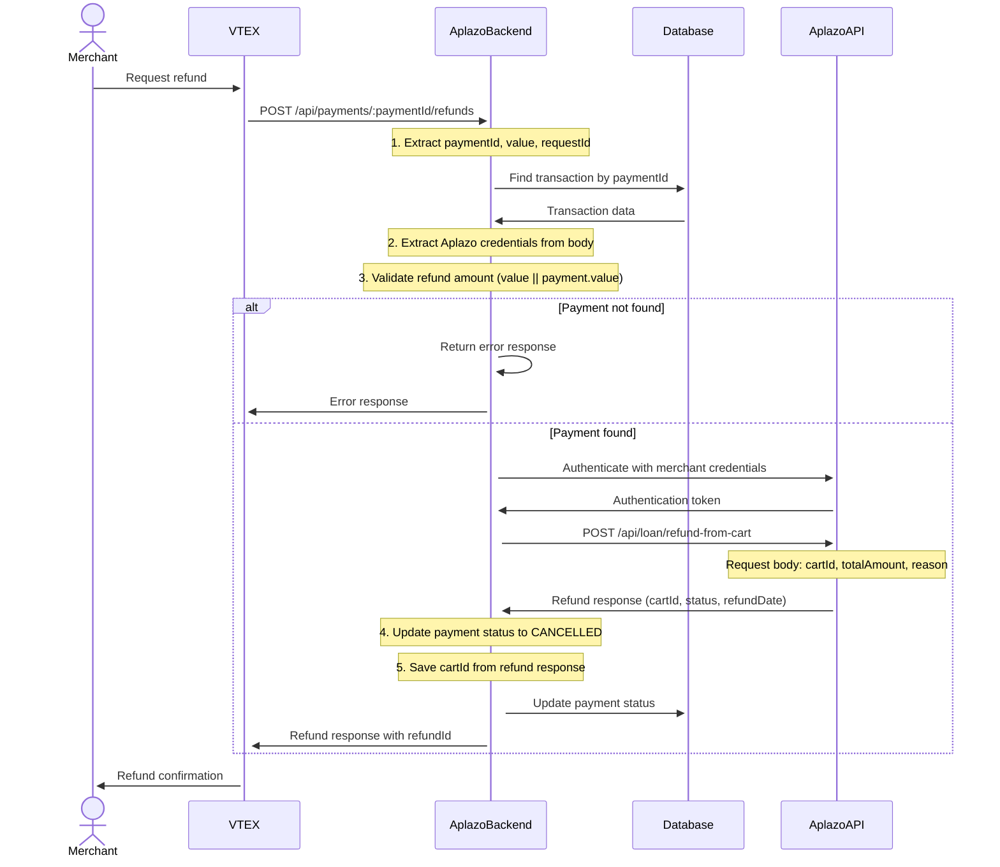

# Aplazo - VTEX 

"This is a backend payment middleman that integrates VTEX e-commerce platform with Aplazo Redirected Checkout API for processing installment payments. The system implements a redirect-based payment flow where customers are redirected from VTEX to Aplazo's payment page to complete their installment purchase, then returned to VTEX upon payment completion.


**Integration Docs**: [Aplazo - Vtex](https://aplazo.gitbook.io/aplazo-integrations/online-api/overview)

## Table of Contents

- [Tech Stack](#tech-stack)
- [Environment Variables](#environment-variables)
- [Installing Dependencies](#installing-dependencies)
- [Docker Compose](#docker-compose)
- [Running the Project](#running-the-project)
- [Project Structure](#project-structure)
- [API Endpoints](#api-endpoints)
- [Flow Diagrams](#flow-diagrams)
- [Middleware and Validations](#middleware-and-validations)
- [Error Handling](#error-handling)
- [Logging](#logging)
- [Lint and Prettier](#lint-and-prettier)

---

## Tech Stack

| Category                  | Technologies                                                                     |
|---------------------------|----------------------------------------------------------------------------------|
| **Backend Framework**     | NestJS (v8.0.0), Node.js (v20), TypeScript (v4.3.5), Express.js                |
| **Database**              | MongoDB (v5.13.3) with Mongoose ODM                                             |
| **Payment Integration**   | Aplazo API, VTEX API, Axios HTTP client                                         |
| **Authentication**        | Passport.js, JWT (JSON Web Tokens), Local Strategy                               |
| **Frontend**              | React (v16.14.0), Redux Toolkit, Material-UI (v4.12.2), React Router DOM        |
| **Build Tools**           | Webpack (v5.46.0), Babel, CSS/SCSS loaders                                       |
| **Development Tools**     | ESLint, Prettier, Jest (v27.0.6), Supertest, TypeScript compiler                |
| **Process Management**    | PM2 (Production), NestJS CLI                                                     |
| **Deployment**            | Docker (Node.js 20 Alpine), Docker Compose, PM2 ecosystem                        |

## Environment Variables
The environment variables can be found and modified in the `.env.example` file. They come with these default values:

```bash
# Port number
PORT=
NODE_ENV=

API_URL=
FRONTEND_URL=

CRYPTOJS_SECRET_KEY=

# URL of the Mongo DB
MONGODB_URL=

VTEX_API_KEY=
VTEX_API_TOKEN=
JWT_SECRET_KEY=
EXPIRES_IN=

MONITORING_TOKEN=

# Aplazo API Configuration
URL_APLAZO=
URL_APLAZO_REFUNDS=
APP_URL=

# VTEX API Configuration
APLAZO_APPPKEY=
APLAZO_APPTOKEN=

# Database Configuration
DB_DATABASE=

# Application Configuration
APP_PORT=

```

| Environment Variable   | Description                                  | Default Value                                                                 |
| ---------------------- | -------------------------------------------- | ----------------------------------------------------------------------------- |
| `PORT`                 | The port number of the server                |                                                                               |
| `NODE_ENV`             | The environment mode of the application      |                                                                               |
| `API_URL`              | The base URL of the API                      |                                                                               |
| `FRONTEND_URL`         | The URL of the frontend application          |                                                                               |
| `CRYPTOJS_SECRET_KEY`  | The secret key for CryptoJS operations       |                                                                               |
| `MONGODB_URL`          | The MongoDB connection string                |                                                                               |
| `VTEX_API_KEY`         | VTEX application API key                     |                                                                               |
| `VTEX_API_TOKEN`       | VTEX application API token                   |                                                                               |
| `JWT_SECRET_KEY`       | The secret key for JWT operations            |                                                                               |
| `EXPIRES_IN`           | JWT token expiration time                    |                                                                               |
| `MONITORING_TOKEN`     | Token for accessing monitoring endpoints     |                                                                               |
| `URL_APLAZO`           | Aplazo API base URL                          |                                                                               |
| `URL_APLAZO_REFUNDS`   | Aplazo refunds API URL                       |                                                                               |
| `APP_URL`              | Application base URL                         |                                                                               |
| `APLAZO_APPPKEY`       | Aplazo VTEX API key                          |                                                                               |
| `APLAZO_APPTOKEN`      | Aplazo VTEX API token                        |                                                                               |
| `DB_DATABASE`          | Database connection string                   |                                                                               |
| `APP_PORT`             | Application port number                      |                                                                               |

## Installing Dependencies

```bash
node install
```

## Docker Compose

To run the project locally, you'll need MongoD. Below is an example `docker-compose.yml` for your local setup:

📝 This file is not included in the repository. Create it manually based on your configuration.

```yaml
version: "3.8"

services:
  mongodb:
    image: mongo:latest
    ports:
      - "27017:27017"
    volumes:
      - ./data:/data/db

  mongo-express:
    image: mongo-express
    ports:
      - "8081:8081"
    environment:
      - ME_CONFIG_MONGODB_SERVER=mongodb
    depends_on:
      - mongodb
```

## Running the Project

Start the servers in development mode:

```bash
node run start:dev
```

## Project Structure

```
├── src/                              # Backend source files (NestJS)
│   ├── admin/                        # Admin module
│   │   ├── admin.controller.ts       # Admin endpoints
│   │   └── admin.module.ts          # Admin module configuration
│   ├── auth/                         # Authentication module
│   │   ├── auth.module.ts           # Auth module configuration
│   │   ├── auth.service.ts          # Authentication service
│   │   ├── constants.ts             # JWT constants
│   │   ├── jwt-auth.guard.ts        # JWT authentication guard
│   │   ├── jwt.strategy.ts          # JWT strategy
│   │   ├── local-auth.guard.ts      # Local authentication guard
│   │   └── local.strategy.ts        # Local strategy
│   ├── exceptions/                   # Custom exceptions
│   │   └── CredentialException.ts   # Credential validation exception
│   ├── models/                       # Database models (Mongoose)
│   │   ├── aplazo-user.ts           # Aplazo user model
│   │   ├── configuration.ts         # Configuration model
│   │   ├── credential.ts            # Credential model
│   │   ├── payment.ts               # Payment model
│   │   └── user.ts                  # User model
│   ├── payments/                     # Payments module
│   │   ├── payments.controller.ts    # Payment endpoints
│   │   ├── payments.module.ts       # Payments module configuration
│   │   └── settlement.controller.ts  # Settlement endpoints
│   ├── services/                     # Business logic services
│   │   ├── aplazo.service.ts        # Aplazo API integration
│   │   ├── configuration.service.ts  # Configuration management
│   │   ├── credential.service.ts    # Credential management
│   │   ├── payments.service.ts      # Payment processing
│   │   ├── services.module.ts       # Services module configuration
│   │   ├── users.service.ts         # User management
│   │   └── vtex.service.ts          # VTEX API integration
│   ├── app.controller.ts             # Main application controller
│   ├── app.module.ts                # Root module configuration
│   └── main.ts                      # Application entry point
├── resources/                        # Frontend resources
│   ├── js/                          # React frontend
│   │   ├── assets/                  # Static assets
│   │   │   ├── css/                 # Stylesheets
│   │   │   ├── img/                 # Images
│   │   │   └── jss/                 # Material-UI styles
│   │   ├── components/              # React components
│   │   │   ├── Card/                # Card components
│   │   │   ├── CustomButtons/       # Custom button components
│   │   │   ├── CustomInput/         # Custom input components
│   │   │   ├── CustomTabs/          # Custom tabs components
│   │   │   ├── Grid/                # Grid components
│   │   │   ├── Navbars/             # Navigation components
│   │   │   ├── Sidebar/             # Sidebar components
│   │   │   ├── Snackbar/            # Notification components
│   │   │   ├── Table/               # Table components
│   │   │   ├── Tasks/               # Task components
│   │   │   └── Typography/          # Typography components
│   │   ├── hooks/                   # Custom React hooks
│   │   ├── layouts/                 # Layout components
│   │   ├── services/                # Frontend services
│   │   ├── store/                   # Redux store
│   │   ├── variables/               # Configuration variables
│   │   ├── views/                   # Page components
│   │   │   ├── Configuration/       # Configuration pages
│   │   │   ├── Dashboard/           # Dashboard pages
│   │   │   └── Login/               # Login pages
│   │   ├── index.js                 # Frontend entry point
│   │   └── routes.js                # Frontend routing
│   └── views/                       # Handlebars templates
├── public/                           # Static files
├── deployment/                       # Deployment configuration
│   ├── nginx/                       # Nginx configuration
│   ├── .docker_env-develop          # Development environment variables
│   ├── .docker_env-prod             # Production environment variables
│   ├── deployment.json              # PM2 deployment configuration
│   └── docker-compose.yml           # Docker Compose configuration
├── test/                            # Test files
│   ├── app.e2e-spec.ts             # End-to-end tests
│   └── jest-e2e.json               # Jest E2E configuration
├── .test.env                        # Test environment variables
├── Dockerfile                       # Docker configuration
├── ecosystem.config.json            # PM2 ecosystem configuration
├── nest-cli.json                   # NestJS CLI configuration
├── package.json                     # Project dependencies
├── tsconfig.json                    # TypeScript configuration
├── tsconfig.build.json              # TypeScript build configuration
├── webpack.config.js                # Webpack configuration
└── README.md                        # Project documentation
```

## API Endpoints

List of available routes:

### **Main Application Routes:**

```bash
GET  /                                 # Welcome page (renders index.hbs)
GET  /payment-methods                  # Get available payment methods
GET  /api/manifest                     # Get VTEX payment manifest
```

### **Authentication Routes:**

```bash
POST /auth/login                       # User login (requires LocalAuthGuard)
GET  /profile                          # Get user profile (requires JwtAuthGuard)
```

### **Payment Processing Routes:**

```bash
# Payment Management (requires JwtAuthGuard)
GET  /api/payments                     # Get all payments (with pagination and search)
GET  /api/payments/:id                 # Get specific payment by ID

# Payment Processing (VTEX Integration)
POST /api/payments                     # Create new payment transaction
POST /api/payments/process             # Process payment webhook from Aplazo
POST /api/payments/:paymentId/cancellations  # Cancel payment
POST /api/payments/:paymentId/refunds        # Process refund
POST /api/payments/:paymentId/settlements    # Process settlement

# Alternative Settlement Route
POST /payments/:paymentId/settlements  # Alternative settlement endpoint
```

### **Admin Panel Routes:**

```bash
GET  /admin                            # Admin dashboard (renders index.hbs)
GET  /admin/dashboard                  # Admin dashboard page
GET  /admin/configuration              # Configuration page
GET  /admin/operations                # Operations page
GET  /admin/login                     # Admin login page
```

### **Route Details:**

**Payment Endpoints:**
- `POST /api/payments` - Creates payment transactions with VTEX integration
- `POST /api/payments/process` - Handles Aplazo webhook notifications
- `GET /api/payments` - Retrieves payments with pagination (`page`, `perPage`, `search` parameters)
- `GET /api/payments/:id` - Gets specific payment details

**Settlement & Refund Endpoints:**
- `POST /api/payments/:paymentId/cancellations` - Cancels payment transactions
- `POST /api/payments/:paymentId/refunds` - Processes refunds with amount validation
- `POST /api/payments/:paymentId/settlements` - Processes settlements

**Authentication:**
- `POST /auth/login` - User authentication (uses LocalAuthGuard)
- `GET /profile` - Protected user profile (uses JwtAuthGuard)

**VTEX Integration:**
- `GET /api/manifest` - Returns VTEX payment manifest configuration
- `GET /payment-methods` - Returns available payment methods


## Flow Diagrams

### Payments



### Refunds



## Middleware and Validations
The project implements NestJS-specific middleware, guards, and validation patterns to support authentication, request validation, and error handling.

### **Authentication Guards**

- 🔐 **JwtAuthGuard**  
  Validates JWT tokens for protected endpoints using Passport.js JWT strategy.  
  Authorization: Bearer `<jwt-token>`

  ```typescript
  @Injectable()
  export class JwtAuthGuard extends AuthGuard('jwt') {}
  ```
  **Usage**: Applied to payment management endpoints (`GET /api/payments`, `GET /api/payments/:id`) and user profile (`GET /profile`)

- 🔑 **LocalAuthGuard**  
  Handles local authentication for login endpoints using username/password strategy.  
  **Usage**: Applied to `POST /auth/login` endpoint

  ```typescript
  @Injectable()
  export class LocalAuthGuard extends AuthGuard('local') {}
  ```

### **Authentication Strategies**

- 🎯 **JwtStrategy**  
  Implements JWT token validation and payload extraction using Passport.js.

  ```typescript
  @Injectable()
  export class JwtStrategy extends PassportStrategy(Strategy) {
    constructor() {
      super({
        jwtFromRequest: ExtractJwt.fromAuthHeaderAsBearerToken(),
        ignoreExpiration: false,
        secretOrKey: jwtConstants.secret,
      });
    }

    async validate(payload: any) {
      return { userId: payload.sub, username: payload.username };
    }
  }
  ```

- 🎯 **LocalStrategy**  
  Implements local authentication using username/password validation.

  ```typescript
  @Injectable()
  export class LocalStrategy extends PassportStrategy(Strategy) {
    constructor(private authService: AuthService) {
      super();
    }

    async validate(username: string, password: string): Promise<any> {
      const user = await this.authService.validateUser(username, password);
      if (!user) {
        throw new UnauthorizedException();
      }
      return user;
    }
  }
  ```

### **Custom Exceptions**

- ⚠️ **CredentialException**  
  Custom exception for credential validation errors extending NestJS `UnprocessableEntityException`.

  ```typescript
  export class CredentialException extends UnprocessableEntityException {
    constructor(body, status) {
      super(body, 'ERROR CON LAS CREDENCIALES');
    }
  }
  ```

### **Request Validation**

The project uses NestJS built-in validation patterns:

- **Header Validation**: VTEX API credentials validation through header extraction
  ```typescript
  @Headers('x-vtex-api-appkey') appKey,
  @Headers('x-vtex-api-apptoken') appToken,
  ```

- **Parameter Validation**: Payment ID and query parameter validation
  ```typescript
  @Param('id') id: string
  @Query('page') page,
  @Query('perPage') perPage,
  @Query('search') search,
  ```

- **Body Validation**: Payment interface validation for request bodies
  ```typescript
  @Body() body: PaymentInterface
  ```

### **Error Handling**

- 🚨 **NestJS Exception Filters**  
  Built-in exception handling with proper HTTP status codes and error responses.
  - `UnauthorizedException`: 401 Unauthorized
  - `UnprocessableEntityException`: 422 Unprocessable Entity
  - `InternalServerErrorException`: 500 Internal Server Error

### **Application Configuration**

- 🔧 **Global Middleware**  
  Applied in `main.ts`:
  - Static file serving for public assets
  - Handlebars view engine configuration
  - Port configuration with environment variable fallback

### **Module Structure**

- **AuthModule**: Centralized authentication configuration
  ```typescript
  @Module({
    imports: [
      ServicesModule,
      PassportModule,
      JwtModule.register({
        secret: jwtConstants.secret,
        signOptions: { expiresIn: '3600s' },
      }),
    ],
    providers: [AuthService, LocalStrategy, JwtStrategy],
  })
  ```

🔄 **Request Flow**
1. Request enters NestJS application
2. Route matching and guard execution
3. Controller method execution
4. Service layer processing
5. Response generation with proper error handling

📍 **Route Protection Mapping**

| Route                | Guards Applied                    |
| -------------------- | --------------------------------- |
| `GET /api/payments`  | `JwtAuthGuard`                    |
| `GET /api/payments/:id` | `JwtAuthGuard`                |
| `POST /auth/login`   | `LocalAuthGuard`                  |
| `GET /profile`       | `JwtAuthGuard`                    |
| Payment processing    | No guards (VTEX integration)      |
| Webhook endpoints    | No guards (Aplazo integration)    |


## Error Handling

The application uses NestJS built-in exception handling with custom exceptions and comprehensive logging.

### **Custom Exceptions**

- ⚠️ **CredentialException**: Extends `UnprocessableEntityException` for credential validation errors
  ```typescript
  export class CredentialException extends UnprocessableEntityException {
    constructor(body, status) {
      super(body, 'ERROR CON LAS CREDENCIALES');
    }
  }
  ```

### **Built-in NestJS Exceptions**

- **UnauthorizedException** (401): Used in authentication failures
- **UnprocessableEntityException** (422): Extended by `CredentialException`
- **InternalServerErrorException** (500): Used for unexpected server errors

### **Error Handling Patterns**

```typescript
// Service layer error handling
try {
  const { data } = await this.http.post('api/auth', { merchantId, apiToken });
  return data.Authorization;
} catch (error) {
  if (error.response.status == 404) {
    throw new CredentialException(error.response.data, error.response.status);
  }
  this.logger.error('ERROR AL TRATAR DE HACER LOGIN ', error);
  throw error;
}
```
## Logging

The project uses NestJS built-in Logger for comprehensive logging across all services.

```typescript
import { Logger } from '@nestjs/common';

// Logger initialization in services
private readonly logger = new Logger(ServiceName.name);

// Logging methods
this.logger.log('Info message');
this.logger.error('Error message', error.stack);
this.logger.warn('Warning message');
this.logger.debug('Debug message');
```

**Usage:**
- **Controllers**: Request/response logging
- **Services**: Business logic and API interaction logging
- **Error Handling**: Detailed error tracking with stack traces
- **Development**: Full logging for debugging
- **Production**: Optimized logging for performance

## Testing

The project uses Jest for testing with NestJS testing utilities:

```bash
# Run all tests
npm test

# Run tests in watch mode
npm run test:watch

# Generate coverage report
npm run test:cov

# Run end-to-end tests
npm run test:e2e

# Debug tests
npm run test:debug
```

**Test Configuration:**
- **Jest**: v27.0.6 with TypeScript support
- **E2E Tests**: `test/app.e2e-spec.ts` with Supertest
- **Test Environment**: Isolated test database (`.test.env`)
- **Coverage**: Reports generated in `coverage/` directory

## Lint and Prettier

Code quality is maintained using ESLint and Prettier.

**Configuration Files:**
- `.eslintrc.js`: ESLint rules and settings
- `.prettierrc.json`: Prettier formatting rules

**Ignore Files:**
- `.eslintignore`: Files/directories excluded from linting
- `.prettierignore`: Files/directories excluded from formatting

**Available Scripts:**
```bash
yarn lint              # Run ESLint
yarn lint:fix          # Run ESLint with auto-fix
yarn prettier          # Check Prettier formatting
yarn prettier:fix      # Fix Prettier formatting
```


## License

[CONEXA]