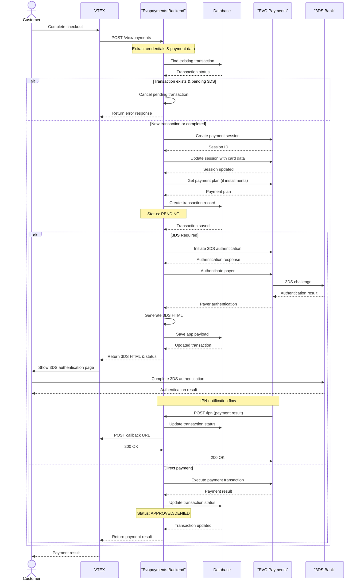
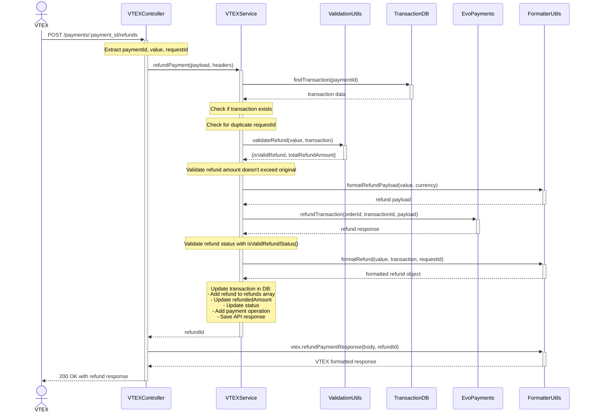

# EVOPAYMENTS - VTEX

This is a transparent/native payment integration that handles transactions for **México**.

> ⚠️ **Note:** The deployment is managed by the client.\
> Our team does not have access to or control over the production environment or the deployment process.

**Integration Docs**: [Evo - Vtex](https://evopaymentsmexico.gateway.mastercard.com/api/documentation)

## Table of Contents

- [Tech Stack](#tech-stack)
- [Environment Variables](#environment-variables)
- [Installing Dependencies](#installing-dependencies)
- [Docker Compose](#docker-compose)
- [Running the Project](#running-the-project)
- [Project Structure](#project-structure)
- [API Endpoints](#api-endpoints)
- [Flow Diagrams](#flow-diagrams)
- [Middleware and Validations](#middleware-and-validations)
- [Error Handling](#error-handling)
- [Logging](#logging)
- [Lint and Prettier](#lint-and-prettier)

---

## Tech Stack

| Category                  | Technologies                                                                     |
|---------------------------|----------------------------------------------------------------------------------|
| **Server**                | Node.js (>=14.0.0), Express.js, TypeScript, MongoDB (Mongoose)           |
| **Payment Integration**   | VTEX Package TS, EvoPayments SDK, Conexa Core Server                        |
| **Security & Middleware** | Helmet, XSS Protection, CORS, Express Rate Limiting, CryptoJS, express-mongo-sanitize, Conexa Core Server |
| **Logging & Monitoring**  | Winston, Conexa Core Server, Health Checks, Morgan                                     |
| **Development Tools**     | ESLint, Prettier, Husky, Jest (unit testing), Supertest (API testing), Nock (HTTP mocking), Commitizen |
| **Deployment**            | Docker, Docker Compose, Jenkins CI/CD, AWS ECR, Docker Swarm                                           |

## Environment Variables
The environment variables can be found and modified in the `.env.example` file. They come with these default values:

```bash
# Port number
# PORT #
# Allways 81 on the server
PORT=5420
NODE_ENV=production
SCOPE=stage
DB_URL=mongodb://127.0.0.1:27017/evopayment-backend
API_URL="http://localhost:$PORT"
FRONTEND_URL="http://localhost:3000"
SECRET_KEY=
PRIVATE_KEY=

ECOMMERCE_PUBLIC=
ECOMMERCE_SECRET=
ECOMMERCE_URL=
ECOMMERCE_UNIQUE_ID=

# CLIENT KEYS
CLIENT_PUBLIC=
CLIENT_URL=
CLIENT_UNIQUE_ID=

```

| Environment Variable   | Description                                  | Default Value                                                                 |
| ---------------------- | -------------------------------------------- | ----------------------------------------------------------------------------- |
| `PORT`                 | The port number of the server (always 81 on server) | `5420`                                                                        |
| `NODE_ENV`             | The environment mode of the application      | `production`                                                                 |
| `SCOPE`                | The scope/environment (production, stage, development, test) | `stage`                                                                        |
| `DB_URL`               | The MongoDB connection string                | `mongodb://127.0.0.1:27017/evopayment-backend`                                |
| `API_URL`              | The base URL of the API                      | `http://localhost:$PORT`                                                      |
| `FRONTEND_URL`         | The URL of the frontend application          | `http://localhost:3000`                                                       |
| `SECRET_KEY`           | The secret key for encryption operations     | ``                                                                            |
| `PRIVATE_KEY`          | The client private key for Conexa Core       | ``                                                                            |
| `ECOMMERCE_PUBLIC`     | VTEX application API key                     | ``                                                                            |
| `ECOMMERCE_SECRET`     | VTEX application API token                   | ``                                                                            |
| `ECOMMERCE_URL`        | VTEX ecommerce URL                           | ``                                                                            |
| `ECOMMERCE_UNIQUE_ID`  | VTEX Payment App name                        | ``                                                                            |
| `CLIENT_PUBLIC`        | Client public key                            | ``                                                                            |
| `CLIENT_URL`           | Client URL                                   | ``                                                                            |
| `CLIENT_UNIQUE_ID`     | Client unique ID (EvoPayments Version SDK)   | ``                                                                            |

## Installing Dependencies

```bash
yarn install-all
```

## Docker Compose

To run the project locally, you'll need MongoD. Below is an example `docker-compose.yml` for your local setup:

📝 This file is not included in the repository. Create it manually based on your configuration.

```yaml
version: "3.8"

services:
  mongodb:
    image: mongo:latest
    ports:
      - "27017:27017"
    volumes:
      - ./data:/data/db

  mongo-express:
    image: mongo-express
    ports:
      - "8081:8081"
    environment:
      - ME_CONFIG_MONGODB_SERVER=mongodb
    depends_on:
      - mongodb
```

## Running the Project

Start the servers in development mode:

```bash
yarn dev
```

## Project Structure

```
├── src                               # Source files
│   ├── config                        # Configuration files
│   │   ├── config.ts                 # Environment variables and app config
│   │   ├── app.ts                    # App configuration
│   │   └── paymentProvider.ts        # Payment provider settings
│   ├── constants                     # Constants
│   │   ├── environment.constants.ts  # Environment constants
│   │   ├── evo.constants.ts          # EvoPayments constants
│   │   └── vtex.constants.ts         # VTEX constants
│   ├── controllers                   # Controllers
│   │   ├── vtex.controllers.ts       # VTEX payment endpoints
│   │   ├── ipn.controllers.ts        # Instant Payment Notification
│   │   └── webhooks.controllers.ts   # Webhook handlers
│   ├── interfaces                    # TypeScript interfaces
│   │   ├── payment.interfaces.ts     # Payment data structures
│   │   ├── transaction.interfaces.ts # Transaction models
│   │   ├── vtex.interfaces.ts        # VTEX data structures
│   │   ├── evo.interfaces.ts         # EvoPayments interfaces
│   │   └── ipn.interfaces.ts         # IPN interfaces
│   ├── lib                           # Library files
│   │   └── toJSON/                   # JSON conversion utilities
│   │       ├── index.ts              # Export file
│   │       └── toJSON.ts             # JSON conversion logic
│   ├── middlewares                   # Middlewares
│   │   └── vtex.middlewares.ts       # VTEX-specific middleware
│   ├── models                        # Models (Mongoose)
│   │   └── Transaction.ts            # Transaction schema
│   ├── routes                        # Routes
│   │   ├── index.routes.ts           # Main router configuration
│   │   ├── vtex.routes.ts            # VTEX payment routes
│   │   ├── ipn.routes.ts             # IPN webhook routes
│   │   └── webhooks.routes.ts        # Webhook routes
│   ├── services                      # Services
│   │   ├── vtex.service.ts           # VTEX integration logic
│   │   ├── evo.service.ts            # EvoPayments SDK integration
│   │   ├── transaction.service.ts    # Transaction database operations
│   │   ├── ipn.service.ts            # IPN processing logic
│   │   └── index.ts                  # Service exports
│   ├── tests                         # Tests
│   │   ├── e2e/                      # End-to-end tests
│   │   ├── mocks/                    # Test mocks and fixtures
│   │   ├── utils/                    # Test utilities
│   │   └── setupTestDB.ts            # Test database setup
│   ├── utils                         # Utility functions
│   │   ├── formatter.utils.ts        # Data formatting utilities
│   │   ├── validation.utils.ts       # Validation helpers
│   │   ├── vtex.utils.ts             # VTEX-specific utilities
│   │   ├── evo.utils.ts              # EvoPayments utilities
│   │   ├── ipn.utils.ts              # IPN utilities
│   │   ├── manifest.utils.ts         # Manifest utilities
│   │   ├── paymentApp.utils.ts       # Payment app utilities
│   │   ├── dateUtils.ts              # Date utilities
│   │   ├── encryption.utils.ts       # Encryption utilities
│   │   ├── safeSliceBytes.utils.ts   # Safe byte slicing
│   │   └── index.ts                  # Utility exports
│   ├── validations                   # Validation schemas
│   │   ├── vtex.validations.ts       # VTEX validation schemas
│   │   ├── ipn.validations.ts        # IPN validation schemas
│   │   └── webhooks.validations.ts   # Webhook validation schemas
│   ├── app.ts                        # Express App configuration
│   ├── index.ts                      # Application entry point
│   ├── custom.d.ts                   # Custom TypeScript declarations
│   └── declaration.d.ts              # Type declarations
├── docs/                             # Documentation
│   ├── openapi.json                  # OpenAPI specification
│   ├── postman-collection.json       # Postman collection
│   └── swagger-collection.json       # Swagger collection
├── Dockerfile                        # Docker configuration
├── docker-compose.yml                # Docker Compose setup
├── Jenkinsfile-stage                 # Jenkins CI/CD pipeline
├── ecosystem.config.json             # PM2 configuration
├── jest.config.cjs                   # Jest test configuration
├── package.json                      # Dependencies and scripts
├── tsconfig.json                     # TypeScript configuration
└── README.md                         # Project documentation
```

## API Endpoints

List of available routes (base path: `/api/v1`):

**VTEX Payment Routes:**

```bash
POST /vtex/payments                    # Create payment transaction
POST /vtex/payments/:payment_id/settlements    # Process settlement
POST /vtex/payments/:payment_id/cancellations  # Cancel payment
POST /vtex/payments/:payment_id/refunds        # Process refund
```

**IPN (Instant Payment Notification) Routes:**

```bash
GET  /ipn/continue/:paymentId          # Continue 3DS payment flow
```

**Webhooks Routes:**

```bash
POST /webhooks/threeds/:paymentId      # Handle 3DS authentication result
```

**Health Check Routes:**

```bash
GET  /health                           # Health check endpoint
```

## Flow Diagrams

### Payments



### Refunds



## Middleware and Validations
The project includes custom middleware to support authentication, request validation, error handling, and monitoring access control.

- 🛡️ **decryptRequestMiddleware** (from `conexa-core-server`)  
  External middleware from the Conexa Core Server library for request decryption.  
  Usage: Applied to routes with `security: true` flag in route configuration.

- 🔍 **validateMiddleware** (from `conexa-core-server`)  
  External middleware from the Conexa Core Server library for request validation using Joi schemas.  
  Usage: Applied to IPN and webhook endpoints for payload validation.

- 🔐 **validateVtexHeaders**  
  Validates VTEX API headers for authentication.  
  Headers: `x-vtex-api-appkey`, `x-vtex-api-apptoken`

  ```js
  // Validates against vtexHeadersSchema
  const headersValidation = vtexHeadersSchema.validate(req.headers, {
    abortEarly: false
  });
  ```
  Usage: Available for VTEX endpoints (currently not applied in routes).

- 💱 **validateCurrency**  
  Validates currency codes for VTEX payment requests.  
  Body Parameter: `currency`

  ```js
  // Validates against validCurrencies array
  if (!validCurrencies.includes(currency as Currencies)) {
    return res.status(httpStatus.BAD_REQUEST).json({ message: 'Invalid currency' });
  }
  ```
  Usage: Available for VTEX payment endpoints (currently not applied in routes).

- ⚠️ **errorHandler** (from `conexa-core-server`)  
  Handles final error responses with environment-specific behavior.  
  **Features:**
  - Masks internal errors in production
  - Includes stack traces in development
  - Standardizes error response format
  - Logs errors in development mode

- 🔧 **Global Security Middleware**  
  Applied globally in `app.ts`:  
  - `helmet`: Security HTTP headers  
  - `cors`: Cross-origin resource sharing  
  - `xss`: XSS protection  
  - `express-mongo-sanitize`: MongoDB injection protection  
  - `compression`: Gzip compression  
  - `HttpLogger`: Request/response logging (non-test environments)

🔄 **Middleware Application Flow**
1. Global Security Middleware (`app.ts`)
2. Route-specific Middleware (based on route configuration)
3. Controller Logic
4. Error Handling (`errorHandler`)

📍 **Route Middleware Mapping**

| Route                | Middleware Applied                    |
| -------------------- | ------------------------------------- |
| `/api/v1/vtex/*`     | None (public endpoints)               |
| `/api/v1/ipn/*`      | `decryptRequestMiddleware` + `validateMiddleware` |
| `/api/v1/webhooks/*` | `validateMiddleware` (no security)    |
| `/health`            | None (health check endpoint)          |

## Logging

The project uses two types of loggers from `conexa-core-server`:

### 🔍 **Logger** (Global Logger)
```js
import { Logger } from 'conexa-core-server';

Logger.error('message'); // level 0
Logger.warn('message');  // level 1
Logger.info('message');  // level 2
Logger.http('message');  // level 3
Logger.verbose('message'); // level 4
Logger.debug('message'); // level 5
```

### 🔄 **FlowLogger** (Transaction-Specific Logger)
```js
import { FlowLogger } from 'conexa-core-server';

const logger = new FlowLogger(getReqId(paymentId));
logger.debug('===== PAYMENTS =====');
logger.info(`Order id ${orderId} status notified to Vtex`);
logger.error(`Order id ${paymentId} not found`);
```

### 📊 **HttpLogger** (Request/Response Logging)
Automatically logs HTTP requests and responses (disabled in test environments).

### 📝 **Configuration**
- **Development/Stage**: All log levels printed
- **Production**: Only `info`, `warn`, and `error` logs
- **Test**: HttpLogger disabled

## Lint and Prettier

Linting is done using ESLint and Prettier.

To modify configurations, update:
- `.eslintrc.js` for ESLint rules
- `.prettierrc.json` for Prettier formatting

To exclude files from linting, add them to `.eslintignore` and `.prettierignore`.

## License

[CONEXA]