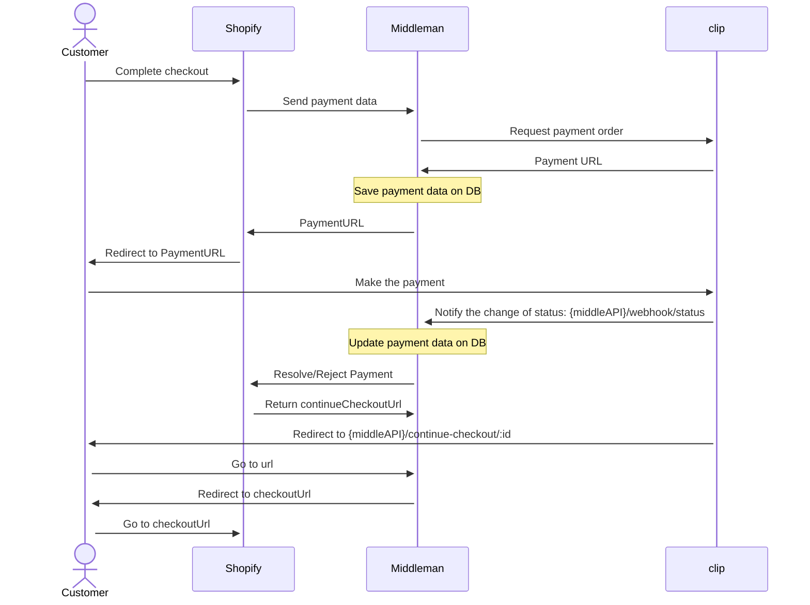
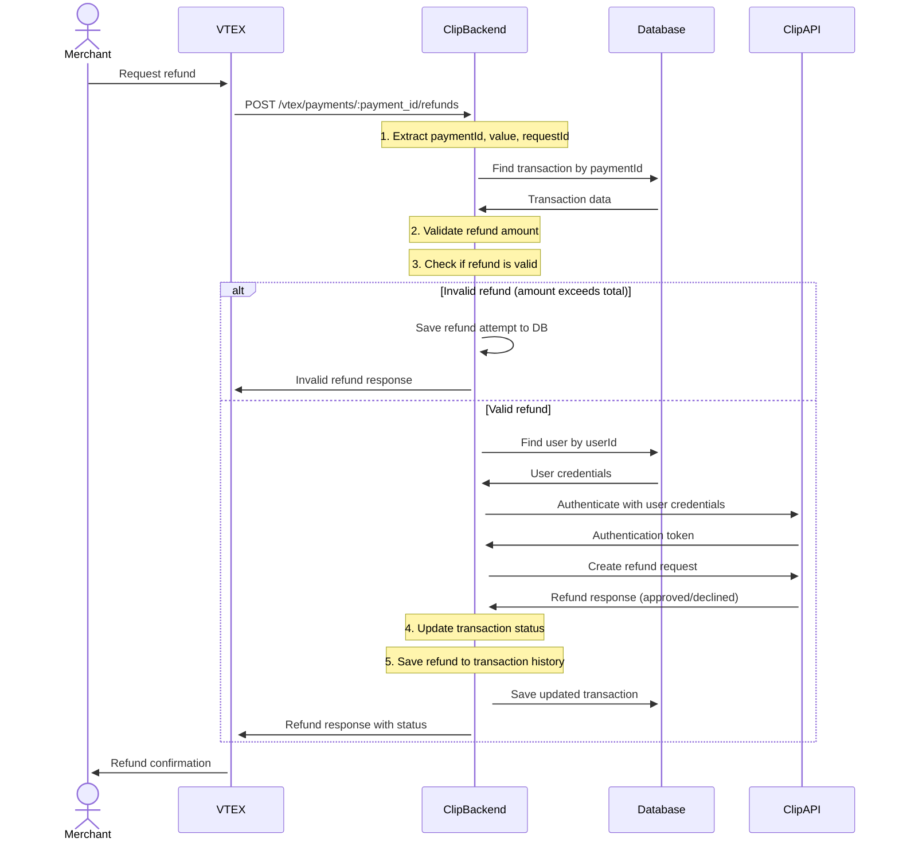

# Clip - VTEX - Redirect

"This is a backend payment gateway that integrates VTEX e-commerce platform with Clip's Redirected Checkout API for processing various payment methods including credit/debit cards, cash payments, and bank transfers (SPEI) across Mexico. The system redirects customers to Clip's secure online payment site during checkout, supports installment plans up to 24 months without interest, international card processing, and provides real-time payment status updates through webhook notifications"

**Integration Docs**: [Clip - Vtex - Redirect](https://developer.clip.mx/reference/introduccion-a-clip-checkout#objeto-completo)

## Table of Contents

- [Tech Stack](#tech-stack)
- [Environment Variables](#environment-variables)
- [Installing Dependencies](#installing-dependencies)
- [Docker Compose](#docker-compose)
- [Running the Project](#running-the-project)
- [Project Structure](#project-structure)
- [API Endpoints](#api-endpoints)
- [Flow Diagrams](#flow-diagrams)
- [Middleware and Validations](#middleware-and-validations)
- [Error Handling](#error-handling)
- [Logging](#logging)
- [Lint and Prettier](#lint-and-prettier)

---

## Tech Stack

| Category                  | Technologies                                                                     |
|---------------------------|----------------------------------------------------------------------------------|
| **Server**                | Node.js (>=14.0.0), Express.js, TypeScript, MongoDB (Mongoose)           |
| **Payment Integration**   | VTEX Package TS, Clip SDK v2, Clip Redirected Checkout API                        |
| **Security & Middleware** | Helmet, XSS Protection, CORS, Express Rate Limiting, CryptoJS, express-mongo-sanitize, Conexa Core Server |
| **Logging & Monitoring**  | Winston, Conexa Core Server, Health Checks, Morgan                                     |
| **Development Tools**     | ESLint, Prettier, Husky, Jest (unit testing), Supertest (API testing), Nock (HTTP mocking), Commitizen |
| **Deployment**            | Docker, Docker Compose, Kubernetes (Helm Charts), GitLab CI/CD                                           |

## Environment Variables
The environment variables can be found and modified in the `.env.example` file. They come with these default values:

```bash
# Port number
PORT=5420
NODE_ENV=development

API_URL="https://72tz1k0p-5420.brs.devtunnels.ms"
FRONTEND_URL="https://localhost:3000"

CRYPTOJS_SECRET_KEY=123456

# URL of the Mongo DB
MONGODB_URL=mongodb://127.0.0.1:27017/new-clip

VTEX_API_KEY=A
VTEX_API_TOKEN=B
JWT_SECRET_KEY=B
EXPIRES_IN='7d'

```

| Environment Variable   | Description                                  | Default Value                                                                 |
| ---------------------- | -------------------------------------------- | ----------------------------------------------------------------------------- |
| `PORT`                 | The port number of the server                | `5420`                                                                        |
| `NODE_ENV`             | The environment mode of the application      | `development`                                                                 |
| `API_URL`              | The base URL of the API                      | `https://72tz1k0p-5420.brs.devtunnels.ms`                      |
| `FRONTEND_URL`         | The URL of the frontend application          | `https://localhost:3000`                          |
| `CRYPTOJS_SECRET_KEY`  | The secret key for CryptoJS operations       | `123456`                                                                    |
| `MONGODB_URL`          | The MongoDB connection string                | `mongodb://127.0.0.1:27017/new-clip`                                          |
| `VTEX_API_KEY`         | VTEX application API key                     | `A`                                                     |
| `VTEX_API_TOKEN`       | VTEX application API token                   | `B`                                                                            |
| `JWT_SECRET_KEY`       | The secret key for JWT operations            | `B`                                                                            |
| `EXPIRES_IN`           | JWT token expiration time                    | `7d`                                                                            |

## Installing Dependencies

```bash
yarn install-all
```

## Docker Compose

To run the project locally, you'll need MongoD. Below is an example `docker-compose.yml` for your local setup:

📝 This file is not included in the repository. Create it manually based on your configuration.

```yaml
version: "3.8"

services:
  mongodb:
    image: mongo:latest
    ports:
      - "27017:27017"
    volumes:
      - ./data:/data/db

  mongo-express:
    image: mongo-express
    ports:
      - "8081:8081"
    environment:
      - ME_CONFIG_MONGODB_SERVER=mongodb
    depends_on:
      - mongodb
```

## Running the Project

Start the servers in development mode:

```bash
yarn dev
```

## Project Structure

```
├── src                               # Source files
│   ├── config                        # Configuration files
│   │   ├── config.ts                 # Environment variables and app config
│   │   ├── app.ts                    # App configuration
│   │   ├── manifest.ts               # VTEX manifest configuration
│   │   └── paymentProvider.ts        # Payment provider settings
│   ├── constants                     # Constants
│   │   ├── common.ts                 # Common constants
│   │   ├── payment.constants.ts      # Payment constants and mappings
│   │   └── reports.constants.ts      # Reports constants
│   ├── controllers                   # Controllers
│   │   ├── vtex.controller.ts        # VTEX payment endpoints
│   │   ├── ipn.controller.ts         # Instant Payment Notification
│   │   ├── report.controller.ts      # Reports and monitoring
│   │   └── vitals.controller.ts      # Health check endpoints
│   ├── interfaces                    # TypeScript interfaces
│   │   ├── payment.interface.ts      # Payment data structures
│   │   ├── paymentProvider.interfaces.ts # Payment provider interfaces
│   │   ├── transaction.interface.ts  # Transaction models
│   │   ├── user.interfaces.ts        # User data structures
│   │   ├── ipn.interface.ts          # IPN webhook interfaces
│   │   ├── validation.interfaces.ts  # Validation interfaces
│   │   ├── vtex.interface.ts         # VTEX specific interfaces
│   │   └── reports.interface.ts      # Report data structures
│   ├── lib                           # Library files
│   │   ├── ApiError.ts               # Custom error handling
│   │   ├── index.ts                  # Library exports
│   │   ├── pick.ts                   # Object picking utilities
│   │   ├── provider.ts               # Provider utilities
│   │   ├── scripts/                  # Scripts directory
│   │   └── toJSON/                   # JSON utilities
│   ├── middlewares                   # Middlewares
│   │   ├── error.middleware.ts       # Error handling middleware
│   │   ├── report.middleware.ts      # Report access middleware
│   │   ├── validateCurrency.middleware.ts # Currency validation
│   │   └── validateToken.middleware.ts # Token validation
│   ├── models                        # Models (Mongoose)
│   │   ├── Transaction.model.ts      # Transaction schema
│   │   ├── User.model.ts             # User schema
│   │   └── Validation.model.ts       # Validation schema
│   ├── routes                        # Routes
│   │   ├── index.routes.ts           # Main router configuration
│   │   ├── vtex.routes.ts            # VTEX payment routes
│   │   ├── ipn.routes.ts             # IPN webhook routes
│   │   ├── reports.routes.ts         # Report routes
│   │   └── vitals.routes.ts          # Health check routes
│   ├── services                      # Services
│   │   ├── client.service.ts         # HTTP client service
│   │   ├── ipn.service.ts            # IPN webhook processing
│   │   ├── provider.service.ts       # Payment provider service
│   │   ├── reports.service.ts        # Report generation
│   │   ├── validation.service.ts     # Validation service
│   │   ├── vtex.service.ts           # VTEX integration logic
│   │   └── database/                 # Database services
│   │       ├── transaction.service.ts # Transaction operations
│   │       └── user.service.ts       # User operations
│   ├── tests                         # Tests
│   │   ├── e2e/                      # End-to-end tests
│   │   ├── mocks/                    # Test mocks and fixtures
│   │   ├── unit/                     # Unit tests
│   │   └── setupTestDB.ts            # Test database setup
│   ├── utils                         # Utility functions
│   │   ├── encryption.utils.ts       # Encryption utilities
│   │   ├── formatter.utils.ts        # Data formatting utilities
│   │   ├── manifest.utils.ts         # Manifest utilities
│   │   ├── reports.utils.ts          # Report utilities
│   │   ├── translation.utils.ts      # Status translation utilities
│   │   └── validation.utils.ts       # Validation helpers
│   ├── validations                   # Validation schemas
│   │   └── provider.validation.ts    # Provider validation
│   ├── docs                          # Documentation
│   │   ├── openapi.json              # OpenAPI specification
│   │   └── postman-collection.json   # API documentation
│   ├── app.ts                        # Express App configuration
│   ├── index.ts                      # Application entry point
│   ├── custom.d.ts                   # Custom TypeScript declarations
│   └── declaration.d.ts              # Type declarations
├── automation/                       # Kubernetes deployment files
├── Dockerfile                        # Docker configuration
├── jest.config.cjs                   # Jest test configuration
├── package.json                      # Project dependencies
├── tsconfig.json                     # TypeScript configuration
├── yarn.lock                         # Yarn lock file
└── README.md                         # Project documentation
```

## API Endpoints

List of available routes (base path: `/api/v1`):

**VTEX Payment Routes:**

```bash
GET  /vtex/manifest                    # Get VTEX payment manifest
GET  /vtex/payment-methods             # Get available payment methods
POST /vtex/payments                    # Create payment transaction
POST /vtex/payments/:payment_id/settlements    # Process settlement
POST /vtex/payments/:payment_id/cancellations  # Cancel payment
POST /vtex/payments/:payment_id/refunds        # Process refund
```

**IPN (Instant Payment Notification) Routes:**

```bash
POST /webhooks                         # Handle Clip webhook events
```

**Reports Routes:**

```bash
GET  /reports/last-orders              # Get last orders
GET  /reports/status-orders            # Get status orders
GET  /reports/client/health            # Check client health status
GET  /reports/health/client-ui         # Check UI health status
```

**Health Check Routes:**

```bash
GET  /                                 # Welcome message
GET  /dbCheck                          # Database health check
```

**Alternative Routes (without prefix):**

```bash
GET  /vtex/manifest                    # Get VTEX payment manifest (alternative)
GET  /vtex/payment-methods             # Get available payment methods (alternative)
POST /vtex/payments                    # Create payment transaction (alternative)
POST /vtex/payments/:payment_id/settlements    # Process settlement (alternative)
POST /vtex/payments/:payment_id/cancellations  # Cancel payment (alternative)
POST /vtex/payments/:payment_id/refunds        # Process refund (alternative)
```

## Flow Diagrams

### Payments



### Refunds



## Middleware and Validations
The project includes custom middleware to support authentication, request validation, error handling, and monitoring access control.

- 🔐 **ReportMiddleware**  
  Validates monitoring access using a Bearer token for report endpoints.  
  Authorization: Bearer `<monitoring-token>`

  ```js
  // Validates against config.api.monitoringToken
  if (!authorization || authorization.split(' ')[1] !== config.api.monitoringToken) {
    return res.sendStatus(httpStatus.UNAUTHORIZED);
  }
  ```
  Usage: Applied to `/api/v1/reports/last-orders` and `/api/v1/reports/status-orders` endpoints for monitoring access control.

- 🔑 **validateToken**  
  Validates JWT tokens for IPN webhook endpoints to prevent duplicate processing and ensure webhook authenticity.  
  Query Parameter: `token=<jwt-token>`

  ```js
  // Validates JWT token and checks if transaction was already processed
  const decodedToken = jwt.verify(token, jwtKeys.secret) as ITokenPayload;
  const validation = await findValidationById(decodedToken.id);
  const isValidToken = verifyToken(validation, decodedToken.verify);
  ```
  **Features:**
  - JWT token verification
  - Prevents duplicate webhook processing
  - Validates webhook authenticity
  - Handles different webhook event types

- 💱 **validateCurrency**  
  Validates that the payment currency is supported by the system.  
  Supported currencies: `MXN`, `USD`

  ```js
  // Validates against validCurrencies array
  if (!validCurrencies.includes(currency as Currencies)) {
    return res.status(httpStatus.OK).json({
      paymentId,
      status: 'denied',
      message: 'Currency not allowed',
      code: null,
      cancellationId: null,
    });
  }
  ```
  Usage: Applied to `POST /vtex/payments` endpoint to ensure only supported currencies are processed.

- 🛡️ **decryptRequestMiddleware** (from `conexa-core-server`)  
  External middleware from the Conexa Core Server library for request decryption.  
  Usage: Applied to routes with `security: true` flag in route configuration.

- ⚠️ **errorConverter**  
  Converts various error types to standardized ApiError format with proper HTTP status codes.  
  **Features:**
  - Converts Mongoose errors to `400 Bad Request`
  - Handles validation errors with message cleanup
  - Generates error codes from error messages
  - Preserves stack traces in development

- 🚨 **errorHandler**  
  Handles final error responses with environment-specific behavior.  
  **Features:**
  - Masks internal errors in production
  - Includes stack traces in development
  - Standardizes error response format
  - Logs errors in development mode

- 🔧 **Global Security Middleware**  
  Applied globally in `app.ts`:  
  - `helmet`: Security HTTP headers  
  - `cors`: Cross-origin resource sharing  
  - `xss`: XSS protection  
  - `express-mongo-sanitize`: MongoDB injection protection  
  - `compression`: Gzip compression  
  - `HttpLogger`: Request/response logging (non-test environments)

🔄 **Middleware Application Flow**
1. Global Security Middleware (`app.ts`)
2. Route-specific Middleware (based on route configuration)
3. Controller Logic
4. Error Conversion (`errorConverter`)
5. Error Handling (`errorHandler`)

📍 **Route Middleware Mapping**

| Route                | Middleware Applied                    |
| -------------------- | ------------------------------------- |
| `/api/v1/vtex/*`     | `validateCurrency` (payments only)    |
| `/api/v1/webhooks/*` | `validateToken`                       |
| `/api/v1/reports/*`  | `ReportMiddleware` (specific routes)  |
| Secure routes        | `decryptRequestMiddleware`            |

## Logging

The project uses the `Logger` from `conexa-core-server` which is built on top of Winston logging library. The logging system provides comprehensive tracking of application events, errors, and debugging information.

### **Import and Usage**

```js
import { Logger } from 'conexa-core-server';

Logger.error('message'); // level 0 - Critical errors
Logger.warn('message');  // level 1 - Warnings
Logger.info('message');  // level 2 - General information
Logger.http('message');  // level 3 - HTTP requests
Logger.verbose('message'); // level 4 - Verbose information
Logger.debug('message'); // level 5 - Debug information
```

### **Logging Configuration**

The logging behavior is configured through the Conexa Core Server initialization in `app.ts`:

```js
configure({
  secretKey: cryptojsKey,
  privateKey: cryptojsKey,
  securityBypass: env !== production,
  debug: env !== production,
  env,
});
```

### **HTTP Request Logging**

The application automatically logs HTTP requests and responses using `HttpLogger`:

```js
if (env !== test) {
  app.use(HttpLogger.successHandler);
  app.use(HttpLogger.errorHandler);
}
```

### **Environment-Specific Behavior**

- **Development Mode**: All log levels are printed to the console for comprehensive debugging
- **Production Mode**: Only `info`, `warn`, and `error` logs are printed to reduce noise
- **Test Mode**: HTTP logging is disabled to keep test output clean

### **Common Logging Patterns**

The application uses structured logging with clear section markers:

```js
// Payment flow logging
Logger.info('===== PAYMENTS =====');
Logger.info('===== AUTH TOKEN =====', token);
Logger.info('=====CHECKOUTPAYLOAD=====', checkoutPayload);
Logger.info(`Transaction ${payment.payment_request_id} successfully created`);

// Webhook processing
Logger.info('===== UPDATE STATUS WEBHOOK =====');
Logger.info(`Transaction id ${transaction.referenceId} status notified to Vtex`);

// Error logging with context
Logger.error(`Transaction ${paymentId} does not exist`);
Logger.error(`Credentials missing`);

// Debug information
Logger.debug('=== Reports Validation ====');
Logger.debug(payload);
```

### **Error Logging**

Errors are logged in the error handler middleware:

```js
if (config.env === 'development') Logger.error(err);
```

This ensures that detailed error information is available during development while maintaining security in production.

## Lint and Prettier

The project uses ESLint and Prettier for code quality and formatting. The configuration is set up to enforce consistent code style and catch potential issues early in development.

### **Available Scripts**

```bash
# Linting
yarn lint              # Check for linting errors
yarn lint:fix          # Fix auto-fixable linting errors

# Formatting
yarn prettier          # Check code formatting
yarn prettier:fix      # Fix code formatting automatically
```

### **ESLint Configuration**

The project uses a comprehensive ESLint setup with multiple configurations:

#### **Base Configuration (`.eslintrc.json`)**
- **Extends**: Airbnb Base, Jest, Security, and Prettier configurations
- **Plugins**: Jest, Security, and Prettier
- **Environment**: Node.js and Jest
- **Key Rules**:
  - `no-console`: Error (prevents console.log usage)
  - `func-names`: Off (allows anonymous functions)
  - `no-underscore-dangle`: Off (allows underscore prefixes)
  - `consistent-return`: Off (flexible return statements)
  - `security/detect-object-injection`: Off (disabled for specific use cases)

#### **TypeScript Override**
- **Parser**: `@typescript-eslint/parser`
- **Extends**: Airbnb TypeScript base configuration
- **Project**: Uses `tsconfig.json` for type checking
- **Additional Rules**:
  - `import/prefer-default-export`: Off (allows named exports)

### **Prettier Configuration (`.prettierrc.json`)**

```json
{
  "parser": "typescript",
  "singleQuote": true,
  "trailingComma": "all",
  "printWidth": 110,
  "endOfLine": "auto",
  "tabWidth": 2
}
```

**Key Settings**:
- **Single Quotes**: Enforced for consistency
- **Trailing Commas**: Added to all multiline structures
- **Print Width**: 110 characters per line
- **Tab Width**: 2 spaces for indentation
- **End of Line**: Auto-detection for cross-platform compatibility

### **File Exclusions**

#### **ESLint Ignore (`.eslintignore`)**
```
node_modules
bin
dist
```

#### **Prettier Ignore (`.prettierignore`)**
```
node_modules
coverage
dist
```

### **Integration with Git Hooks**

The project uses `husky` and `lint-staged` to automatically run linting and formatting on staged files before commits, ensuring code quality is maintained.

### **Security Focus**

The ESLint configuration includes the `eslint-plugin-security` plugin to catch common security vulnerabilities:
- SQL injection prevention
- XSS protection
- Object injection detection
- And other security best practices

### **TypeScript Support**

Full TypeScript support with:
- Type-aware linting
- Import/export validation
- Type checking integration
- Modern ES6+ features support

## License

[CONEXA]