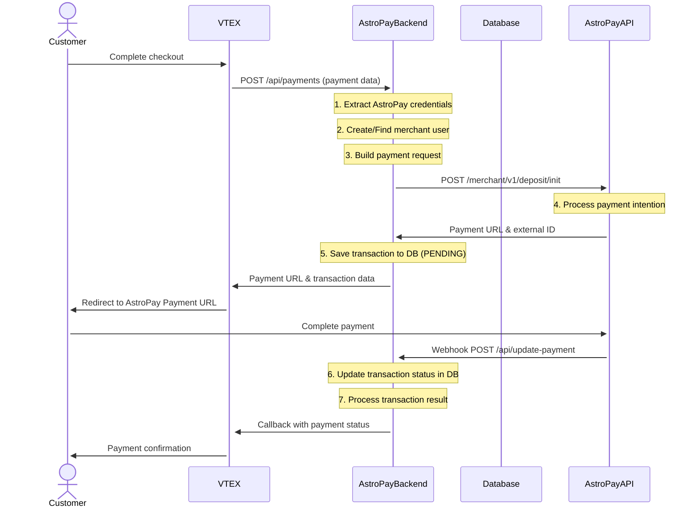
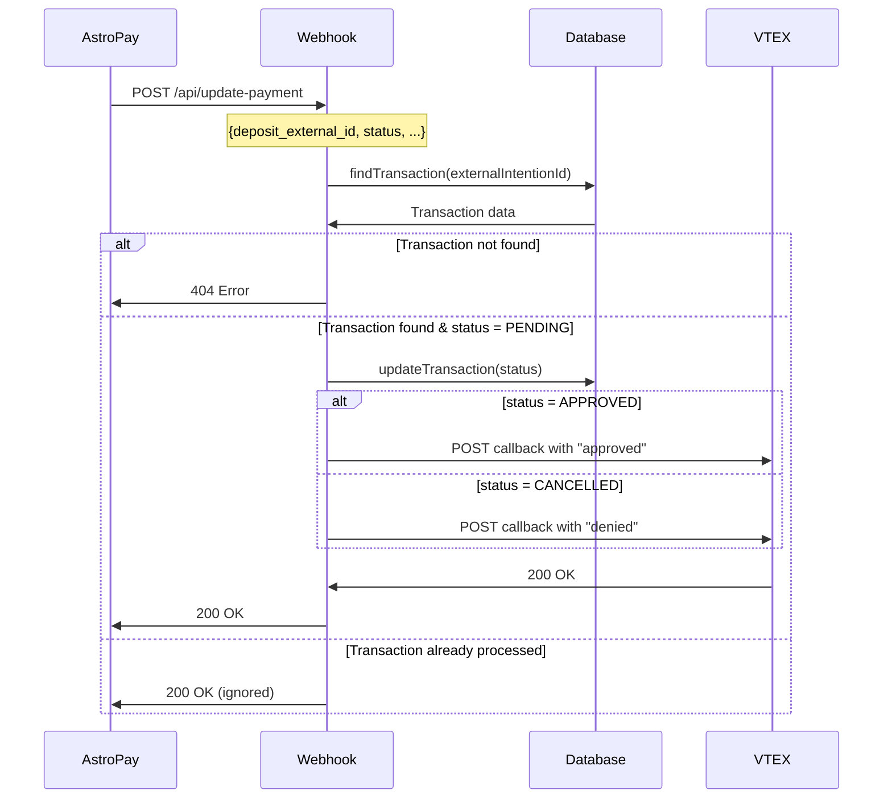

# AstroPay - VTEX 

This is a redirected backend payment intermediary that integrates the VTEX e-commerce platform with Astropay.

## Documentation

### API Documentation
**Backend API Reference**: [Astropay - Vtex](https://developers-wallet.astropay.com/)

### VTEX Connector Installation
**VTEX Connector Setup**: [Astropay Vtex Connector](https://astropay-vtex-docs.netlify.app/)


## Table of Contents

- [Tech Stack](#tech-stack)
- [Environment Variables](#environment-variables)
- [Installing Dependencies](#installing-dependencies)
- [Docker Compose](#docker-compose)
- [Running the Project](#running-the-project)
- [Project Structure](#project-structure)
- [API Endpoints](#api-endpoints)
- [Flow Diagrams](#flow-diagrams)
- [Middleware and Validations](#middleware-and-validations)
- [Error Handling](#error-handling)
- [Logging](#logging)
- [Lint and Prettier](#lint-and-prettier)

---

## Tech Stack

| Category                  | Technologies                                                                     |
|---------------------------|----------------------------------------------------------------------------------|
| **Server**                | Node.js (16-alpine), Express.js, MongoDB (Mongoose)                              |
| **Payment Integration**   | VTEX API Integration, AstroPay API, CryptoJS for HMAC signatures                |
| **Security & Middleware** | CORS, CryptoJS, JWT, bcryptjs                                                   |
| **Logging & Monitoring**  | Winston, Health Checks, Morgan                                                  |
| **Development Tools**     | ESLint, Prettier, Mocha (unit testing), Chai (assertions), Nock (HTTP mocking) |
| **Deployment**            | Docker, Docker Compose, Jenkins CI/CD, PM2 Process Manager                      |

## Environment Variables
The environment variables can be found and modified in the `.env.example` file. They come with these default values:

```bash
# Port number
PORT
NODE_ENV

# VTEX Configuration
VTEX_APPKEY
VTEX_TOKEN
VTEX_URL

# AstroPay Configuration
ASTROPAY_URL

# Database Configuration
MONGO_URI

# Application Configuration
URL_BASE

```

| Environment Variable   | Description                                  |
| ---------------------- | -------------------------------------------- |
| `PORT`                 | The port number of the server                |
| `NODE_ENV`             | The environment mode of the application      |
| `VTEX_APPKEY`          | VTEX application API key                     |
| `VTEX_TOKEN`           | VTEX application API token                   |
| `VTEX_URL`             | VTEX API base URL                           |
| `ASTROPAY_URL`         | AstroPay API base URL                       |
| `MONGO_URI`            | MongoDB connection string                    |
| `URL_BASE`             | Application base URL                         |

## Installing Dependencies

```bash
npm install
```

## Docker Compose

To run the project locally, you'll need MongoD. Below is an example `docker-compose.yml` for your local setup:

📝 This file is not included in the repository. Create it manually based on your configuration.

```yaml
version: "3.8"

services:
  mongodb:
    image: mongo:latest
    ports:
      - "27017:27017"
    volumes:
      - ./data:/data/db

  mongo-express:
    image: mongo-express
    ports:
      - "8081:8081"
    environment:
      - ME_CONFIG_MONGODB_SERVER=mongodb
    depends_on:
      - mongodb
```

## Running the Project

Start the servers in development mode:

```bash
npm run dev
```

## Project Structure

```
├── backend/                          # Backend application
│   ├── config/                       # Configuration files
│   │   └── db.js                     # Database configuration
│   ├── controllers/                  # Controllers
│   │   ├── astroPay.controller.js    # AstroPay payment controller
│   │   └── payments.controller.js    # Payment processing controller
│   ├── models/                       # Database models (Mongoose)
│   │   ├── Transaction.js            # Transaction schema
│   │   └── User.js                   # User schema
│   ├── routes/                       # API routes
│   │   ├── index.js                  # Main router configuration
│   │   ├── astroPay/                 # AstroPay routes
│   │   │   └── astroPay.js          # AstroPay API endpoints
│   │   └── payments/                 # Payment routes
│   │       └── payments.js           # Payment API endpoints
│   ├── services/                     # Business logic services
│   │   ├── astroPay.service.js       # AstroPay integration service
│   │   ├── db.service.js             # Database operations service
│   │   ├── transaction.service.js    # Transaction processing service
│   │   └── utils.service.js          # Utility services
│   ├── test/                         # Test files
│   │   ├── mocks/                    # Test mocks and fixtures
│   │   │   └── mocksPayment.js      # Payment test mocks
│   │   ├── astroPay.controller.test.js # AstroPay controller tests
│   │   ├── astroPay.service.test.js # AstroPay service tests
│   │   ├── db.service.test.js        # Database service tests
│   │   ├── payments.controller.test.js # Payment controller tests
│   │   └── transaction.service.test.js # Transaction service tests
│   ├── utils/                        # Utility functions
│   │   ├── constants/                # Application constants
│   │   │   ├── httpStatus.js         # HTTP status codes
│   │   │   └── index.js              # Constants exports
│   │   ├── logger.js                 # Logging utility
│   │   └── requestHttp.js            # HTTP request utilities
│   ├── app.js                        # Express application setup
│   ├── server.js                     # Server entry point
│   ├── swagger.json                  # API documentation
│   ├── package.json                  # Node.js dependencies
│   ├── package-lock.json             # Dependency lock file
│   ├── Dockerfile                    # Backend Docker configuration
│   ├── docker-compose.yml            # Local development setup
│   ├── Jenkinsfile-prod              # Production deployment pipeline
│   └── .gitignore                    # Git ignore rules
├── ecosystem.config.json             # PM2 process manager configuration
├── Dockerfile                        # Root Docker configuration
├── .gitlab-ci.yml                    # GitLab CI/CD pipeline
└── README.md                         # Project documentation
```

## API Endpoints

List of available routes (base path: `/api`):

**Payment Routes:**

```bash
POST /payments                         # Create payment transaction
GET  /payment-methods                  # Get available payment methods
GET  /manifest                         # Get payment manifest
POST /payments/:payment_id/settlements # Process settlement
```

**AstroPay Webhook Routes:**

```bash
POST /update-payment                   # Handle AstroPay webhook events
```

**Health Check Routes:**

```bash
GET  /                                 # Application root endpoint
GET  /health                           # Health check endpoint
GET  /astropay-vtex-docs              # API documentation (Swagger UI)
```

## Flow Diagrams

### Payments



### webhook



## Middleware and Validations
The project implements a streamlined middleware architecture focused on essential security, validation, and error handling for the AstroPay-VTEX integration.

### **Global Middleware**
Applied globally in `app.js`:

- 🔒 **CORS Middleware**  
  Enables Cross-Origin Resource Sharing for API access.  
  ```js
  app.use(cors());
  ```

- 📝 **Body Parser Middleware**  
  Handles JSON and URL-encoded request bodies with size limits.  
  ```js
  app.use(express.json({ extended: false, limit: "50mb" }));
  app.use(express.urlencoded({ extended: false, limit: "50mb" }));
  ```

### **Validation Utilities**
Located in `services/utils.service.js`:

- ✅ **validateAlphanumeric**  
  Validates alphanumeric strings with hyphens for safe input processing.  
  ```js
  exports.validateAlphanumeric = (value) => {
    const pattern = /^[a-zA-Z0-9--]+$/;
    const regex = new RegExp(pattern);
    return regex.test(value);
  };
  ```

- 🔐 **validatePaymentData**  
  Validates required payment credentials (user, password, storeId).  
  ```js
  exports.validatePaymentData = (user, password, storeId) => {
    return user && password && storeId;
  };
  ```

### **Security Features**

- 🔐 **HMAC Signature Validation**  
  Implements HMAC-SHA256 signature validation for AstroPay API requests.  
  ```js
  const hash = cryptoJS
    .HmacSHA256(JSON.stringify(preRequest), data.astropay_secret)
    .toString();
  headers.Signature = hash;
  ```

- 🛡️ **API Key Authentication**  
  Uses merchant-specific API keys for VTEX and AstroPay integrations.  
  ```js
  headers: {
    "X-VTEX-API-AppKey": process.env.VTEX_APPKEY,
    "X-VTEX-API-AppToken": process.env.VTEX_TOKEN,
  }
  ```

### **Error Handling**

- ⚠️ **Global Error Handlers**  
  Catches unhandled rejections and exceptions with comprehensive logging.  
  ```js
  process.on("unhandledRejection", (reason) => {
    logger.error(`exception occurred \n${JSON.stringify(reason)}`);
    throw reason;
  });
  ```

- 🚨 **Controller-Level Error Handling**  
  Implements try-catch blocks with specific error responses and logging.  
  ```js
  try {
    // Business logic
  } catch (error) {
    logger.error(error);
    return res.sendStatus(500);
  }
  ```

### **Data Validation**

- 💱 **Payment Data Validation**  
  Validates required fields in payment requests including merchant settings, user data, and transaction details.  
  ```js
  const appKeyAstroPay = merchantSettings.find(
    (d) => d.name === "Api Key - Astropay"
  ).value;
  ```

- 🌍 **Country Code Conversion**  
  Converts ISO-3 country codes to ISO-2 format for AstroPay API compatibility.  
  ```js
  const countryIso = getCountryISO2(body.miniCart.billingAddress.country)
  ```

### **Transaction Processing Validation**

- 🔄 **Transaction Status Validation**  
  Validates transaction states and prevents duplicate processing.  
  ```js
  if (transaction.status === "PENDING") {
    // Process transaction
  }
  ```

- 📊 **Database Validation**  
  Validates user existence and transaction integrity before processing.  
  ```js
  const user = await db.findUser({
    astropay_secret: dataUser.astropay_secret,
  });
  ```

### **Middleware Application Flow**

1. **Global Middleware** (`app.js`)
   - CORS configuration
   - Body parsing
   - Request logging

2. **Route Processing**
   - Payment routes (`/api/payments`)
   - AstroPay webhook routes (`/api/update-payment`)

3. **Controller Logic**
   - Data validation
   - Business logic execution
   - Error handling

4. **Response Processing**
   - Success/error response formatting
   - Logging

### **Route Structure**

| Route                | Purpose                                    | Validation Applied                    |
| -------------------- | ------------------------------------------ | ------------------------------------ |
| `POST /api/payments` | Create payment transaction                 | Payment data validation              |
| `GET /api/payment-methods` | Get available payment methods         | None (public endpoint)               |
| `GET /api/manifest`  | Get payment manifest                      | None (public endpoint)               |
| `POST /api/payments/:payment_id/settlements` | Process settlement | Payment ID validation                |
| `POST /api/update-payment` | Handle AstroPay webhooks           | Transaction validation               |

### **Security Considerations**

- **API Key Management**: Uses environment variables for sensitive credentials
- **Request Signing**: HMAC signatures for AstroPay API communication
- **Error Masking**: Internal errors are logged but not exposed to clients
- **Input Validation**: Alphanumeric validation for safe data processing
- **Database Sanitization**: Mongoose provides built-in injection protection

## Logging

The project uses Winston logging library for comprehensive application monitoring and debugging. The logging system is configured in `utils/logger.js` and provides structured logging with timestamps and labels.

### **Logger Configuration**

```js
const { createLogger, format, transports } = require('winston');
const { combine, timestamp, label, printf, colorize } = format;

const myFormat = printf(({ level, message, label, timestamp }) => {
  return `${timestamp} [${label}] ${level}: ${message}`;
});

const logger = createLogger({
  format: combine(colorize(), label({ label: 'ASTROPAY-VTEX' }), timestamp(), myFormat),
  transports: [new transports.Console()],
});
```

### **Usage Throughout the Application**

```js
const logger = require("../utils/logger");

// Payment flow logging
logger.info("===== PAYMENTS =====");
logger.info(`Transaction ${payment.payment_request_id} successfully created`);

// Webhook processing
logger.info("===== UPDATE STATUS WEBHOOK =====");
logger.info(`Transaction ${data.deposit_external_id} APPROVED`);

// Error logging
logger.error(`[Update - Transaction] ${error.toString()}`);
logger.error(`Transaction ${paymentId} does not exist`);

// Server startup
logger.info("@@@@@ FIRING UP SERVER @@@@@");
```

### **Log Format**

The logger produces structured output with:
- **Timestamp**: ISO format timestamps
- **Label**: `ASTROPAY-VTEX` identifier
- **Level**: Color-coded log levels (error, warn, info, debug)
- **Message**: Descriptive log messages

### **Global Error Handling**

The application includes global error handlers that log unhandled exceptions:

```js
process.on("unhandledRejection", (reason) => {
  logger.error(`exception occurred \n${JSON.stringify(reason)}`);
  throw reason;
});

process.on("unhandledException", (reason) => {
  logger.error(`exception occurred \n${JSON.stringify(reason)}`);
  throw reason;
});
```

### **Database Connection Logging**

Database connection status is logged during application startup:

```js
logger.info(`mongoose status:${mongoose.connection.readyState}`);
logger.info(`connected to ${mongoose.connection.name}`);
```

## Testing

The project uses Mocha with Chai for testing, along with Nock for HTTP mocking and NYC for coverage reporting.

### **Test Scripts**

```bash
# Run all tests
npm test

# Run tests with coverage
npm run coverage

# Generate coverage report in LCOV format
npm run coverage-lcov

# Format code
npm run format
```

## Lint and Prettier

`backend/package.json`.

**Dependencias principales:**
- `eslint`
- `eslint-config-airbnb-base`
- `eslint-config-prettier`
- `eslint-plugin-import`
- `eslint-plugin-prettier`
- `prettier`

**Scripts disponibles:**
```bash
npm run format  
```

## License

[CONEXA]