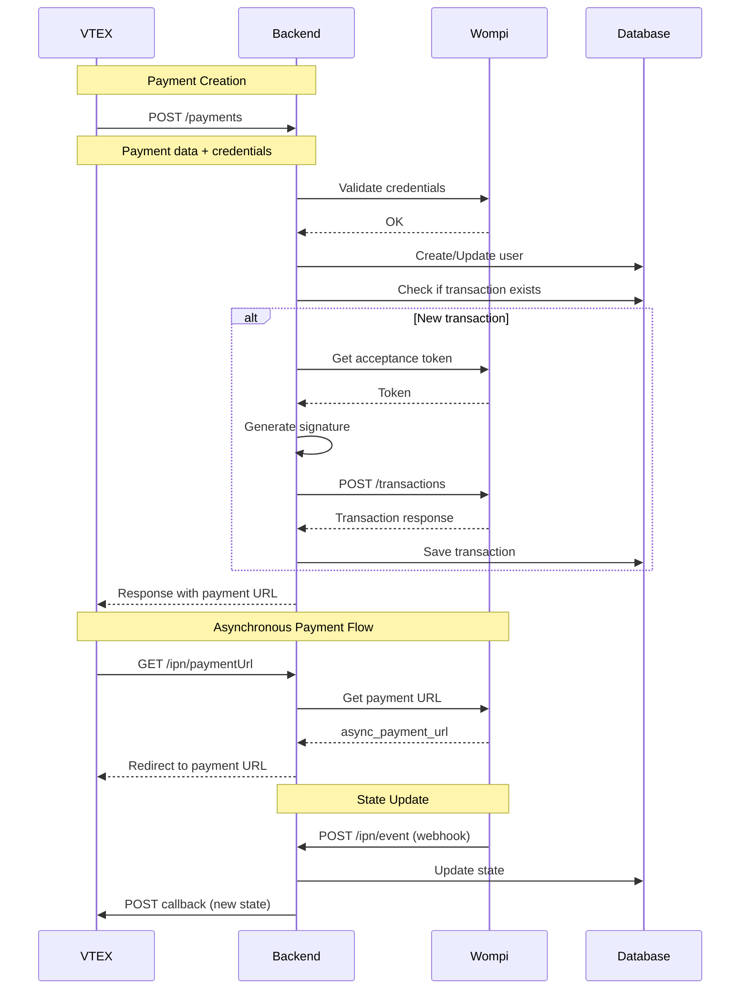
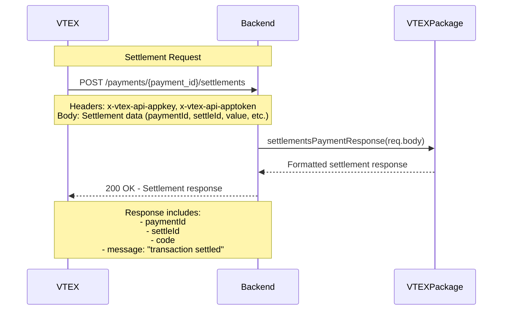
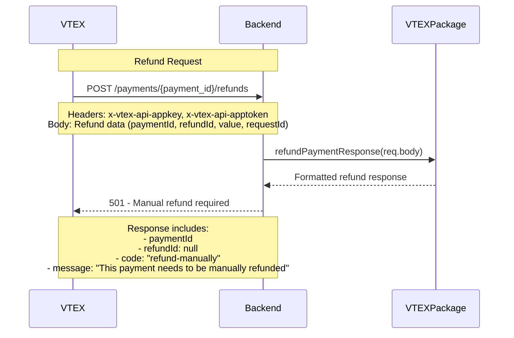

# Wompi - VTEX - BANCOLOMBIA

This is a backend payment connector that integrates VTEX e-commerce platform with Wompi (Bancolombia's payment processor) for processing bank transfers in Colombia.

**Integration Docs**: [Wompi - Vtex - Bancolombia](https://https://docs.wompi.co/docs/colombia/wompi-vtex/)

## Table of Contents

- [Tech Stack](#tech-stack)
- [Environment Variables](#environment-variables)
- [Installing Dependencies](#installing-dependencies)
- [Docker Compose](#docker-compose)
- [Running the Project](#running-the-project)
- [Project Structure](#project-structure)
- [API Endpoints](#api-endpoints)
- [Flow Diagrams](#flow-diagrams)
- [Middleware and Validations](#middleware-and-validations)
- [Error Handling](#error-handling)
- [Logging](#logging)
- [Lint and Prettier](#lint-and-prettier)

---

## Tech Stack
Server: Node.js (see version in Dockerfile), Express.js, TypeScript, MongoDB (Mongoose)
Payment Integration: Wompi SDK (Bancolombia payment processor), VTEX Payment Provider Interface
Security & Middleware: Helmet, XSS protection, CORS, Express rate limiting, CryptoJS, Express MongoDB sanitize
Logging & Monitoring: Winston, Conexa Core Server, Health checks
Development Tools: ESLint, Prettier, Husky, Jest (testing), Supertest (API testing), Nock (HTTP mocking)
Deployment: Docker, Docker Compose, GitLab CI/CD

## Environment Variables
The environment variables can be found and modified in the `.env.example` file. They come with these default values:

```bash
PORT=5420
NODE_ENV=development
API_URL=https://wompi-vtex-colombia-api-stage.conexa.ai/api/v1
FRONTEND_URL=https://wompi-vtex-corresponsales-stage.conexa.ai/
CRYPTOJS_SECRET_KEY=12345678
MONGODB_URL=mongodb://127.0.0.1:27017/wompi-db
#mongodb://localhost:27017/Wompi-Bancolombia
VTEX_API_KEY=vtexappkey-wompi-FNEOVC
VTEX_API_TOKEN=
PRIVATE_KEY=
MONITORING_TOKEN=
```

| Environment Variable   | Description                                  | Default Value                                                                 |
| ---------------------- | -------------------------------------------- | ----------------------------------------------------------------------------- |
| `PORT`                 | The port number of the server                | `5420`                                                                        |
| `NODE_ENV`             | The environment mode of the application      | `development`                                                                 |
| `API_URL`              | The base URL of the API                      | `https://wompi-vtex-colombia-api-stage.conexa.ai/api/v1`                      |
| `FRONTEND_URL`         | The URL of the frontend application          | `https://wompi-vtex-corresponsales-stage.conexa.ai/`                          |
| `CRYPTOJS_SECRET_KEY`  | The secret key for CryptoJS operations       | `12345678`                                                                    |
| `MONGODB_URL`          | The MongoDB connection string                | `mongodb://127.0.0.1:27017/wompi-db`                                          |
| `VTEX_API_KEY`         | VTEX application API key                     | `vtexappkey-wompi-FNEOVC`                                                     |
| `VTEX_API_TOKEN`       | VTEX application API token                   | ``                                                                            |
| `PRIVATE_KEY`          | The client private key for Conexa Core       | ``                                                                            |
| `MONITORING_TOKEN`     | The token for the monitoring service         | ``                                                                            |

## Installing Dependencies

```bash
npm run install-all
```

## Docker Compose

To run the project locally, you'll need MongoD. Below is an example `docker-compose.yml` for your local setup:

📝 This file is not included in the repository. Create it manually based on your configuration.

```yaml
version: "3.8"

services:
  mongodb:
    image: mongo:latest
    ports:
      - "27017:27017"
    volumes:
      - ./data:/data/db

  mongo-express:
    image: mongo-express
    ports:
      - "8081:8081"
    environment:
      - ME_CONFIG_MONGODB_SERVER=mongodb
    depends_on:
      - mongodb
```

## Running the Project

Start the servers in development mode:

```bash
npm run dev
```

## Project Structure

```
├── src                               # Source files
│   ├── config                        # Configuration files
│   │   ├── config.ts                 # Environment variables and app config
│   │   ├── app.ts                    # App configuration
│   │   └── paymentProvider.ts        # Payment provider settings
│   ├── constants                     # Constants
│   │   └── transaction.ts            # Transaction constants and mappings
│   ├── controllers                   # Controllers
│   │   ├── vtex.controller.ts        # VTEX payment endpoints
│   │   ├── ipn.controller.ts         # Instant Payment Notification
│   │   └── report.controller.ts      # Reports and monitoring
│   ├── interfaces                    # TypeScript interfaces
│   │   ├── payment.interface.ts      # Payment data structures
│   │   ├── transaction.interface.ts  # Transaction models
│   │   ├── user.interfaces.ts        # User data structures
│   │   ├── webhook.interface.ts      # Webhook event interfaces
│   │   └── reports.interface.ts      # Report data structures
│   ├── lib                           # Library files
│   │   └── ApiError.ts               # Custom error handling
│   ├── middlewares                   # Middlewares
│   │   └── error.middleware.ts       # Error handling middleware
│   ├── models                        # Models (Mongoose)
│   │   ├── Transaction.model.ts      # Transaction schema
│   │   └── User.model.ts             # User schema
│   ├── routes                        # Routes
│   │   ├── index.routes.ts           # Main router configuration
│   │   ├── vtex.routes.ts            # VTEX payment routes
│   │   ├── ipn.routes.ts             # IPN webhook routes
│   │   └── reports.routes.ts         # Report routes
│   ├── services                      # Services
│   │   ├── vtex.service.ts           # VTEX integration logic
│   │   ├── wompi.service.ts          # Wompi SDK integration
│   │   ├── transaction.service.ts    # Transaction database operations
│   │   ├── user.service.ts           # User database operations
│   │   └── reports.service.ts        # Report generation
│   ├── tests                         # Tests
│   │   ├── e2e                       # End-to-end tests
│   │   ├── mocks                     # Test mocks and fixtures
│   │   └── setupTestDB.ts            # Test database setup
│   ├── utils                         # Utility functions
│   │   ├── formatter.utils.ts        # Data formatting utilities
│   │   ├── mapper.utils.ts           # Status mapping utilities
│   │   ├── validation.utils.ts       # Validation helpers
│   │   ├── lib.ts                    # General utilities
│   │   └── reports.utils.ts          # Report utilities
│   ├── docs                          # Documentation
│   │   └── postman-collection.json   # API documentation
│   ├── app.ts                        # Express App configuration
│   ├── index.ts                      # Application entry point
│   ├── custom.d.ts                   # Custom TypeScript declarations
│   └── declaration.d.ts              # Type declarations
└── README.md                         # Project documentation
```

## API Endpoints

List of available routes (base path: `/api/v1`):

**VTEX Payment Routes:**

```bash
POST /vtex/payments                    # Create payment transaction
POST /vtex/payments/:payment_id/settlements    # Process settlement
POST /vtex/payments/:payment_id/cancellations  # Cancel payment
POST /vtex/payments/:payment_id/refunds        # Process refund
```

**IPN (Instant Payment Notification) Routes:**

```bash
GET  /ipn/async-payment-url/:id        # Get async payment URL
POST /ipn/webhook                      # Handle Wompi webhook events
```

**Reports Routes:**

```bash
GET  /reports/last-orders              # Get last orders
GET  /reports/status-orders            # Get status orders
```

**Health Check Routes:**

```bash
GET  /                                 # Health check
GET  /health                           # Health check
GET  /healthcheck                      # Health check
GET  /health-check                     # Health check
```

## Flow Diagrams

### Payments



### Settlements



### Cancellation


### Refunds



## Middleware and Validations
The project includes custom middleware to support authentication, request validation, error handling, and monitoring access control.

- 🔐 **ReportMiddleware**  
  Validates monitoring access using a Bearer token for report endpoints.  
  Authorization: Bearer `<monitoring-token>`

  ```js
  // Validates against config.api.monitoringToken
  if (!authorization || authorization.split(' ')[1] !== config.api.monitoringToken) {
    return res.sendStatus(httpStatus.UNAUTHORIZED);
  }
  ```
  Usage: Applied to `/api/v1/reports/*` endpoints for monitoring access control.

- 🔓 **validateSource**  
  Decrypts and validates transaction IDs from query parameters for IPN endpoints.  
  Query Parameter: `tid=<encrypted-transaction-id>`

  ```js
  // Decrypts the tid parameter and attaches to req.headers['id']
  const decryptedId = decryptData<string>(id);
  req.headers['id'] = decryptedId.data;
  ```
  Usage: Applied to IPN endpoints for secure transaction identification.

- 🛡️ **decryptRequestMiddleware** (from `conexa-core-server`)  
  External middleware from the Conexa Core Server library for request decryption.  
  Usage: Applied to routes with `security: true` flag in route configuration.

- ⚠️ **errorConverter**  
  Converts various error types to standardized ApiError format with proper HTTP status codes.  
  **Features:**
  - Converts Mongoose errors to `400 Bad Request`
  - Handles validation errors with message cleanup
  - Generates error codes from error messages
  - Preserves stack traces in development

- 🚨 **errorHandler**  
  Handles final error responses with environment-specific behavior.  
  **Features:**
  - Masks internal errors in production
  - Includes stack traces in development
  - Standardizes error response format
  - Logs errors in development mode

- 🔧 **Global Security Middleware**  
  Applied globally in `app.ts`:  
  - `helmet`: Security HTTP headers  
  - `cors`: Cross-origin resource sharing  
  - `xss`: XSS protection  
  - `express-mongo-sanitize`: MongoDB injection protection  
  - `compression`: Gzip compression  
  - `HttpLogger`: Request/response logging (non-test environments)

🔄 **Middleware Application Flow**
1. Global Security Middleware (`app.ts`)
2. Route-specific Middleware (based on route configuration)
3. Controller Logic
4. Error Conversion (`errorConverter`)
5. Error Handling (`errorHandler`)

📍 **Route Middleware Mapping**

| Route                | Middleware Applied           |
| -------------------- | ---------------------------- |
| `/api/v1/vtex/*`     | None (public endpoints)      |
| `/api/v1/ipn/*`      | `validateSource`             |
| `/api/v1/reports/*`  | `ReportMiddleware`           |
| Secure routes        | `decryptRequestMiddleware`   |

## Logging

Import the logger from `conexa-core-server`. It uses the Winston logging library.

```js
import { Logger } from 'conexa-core-server';

Logger.error('message'); // level 0
Logger.warn('message');  // level 1
Logger.info('message');  // level 2
Logger.http('message');  // level 3
Logger.verbose('message'); // level 4
Logger.debug('message'); // level 5
```

In development mode, log messages of all severity levels are printed to the console.  
In production mode, only `info`, `warn`, and `error` logs are printed.

## Lint and Prettier

Linting is done using ESLint and Prettier.

To modify the ESLint configuration, update the `.eslintrc.js` file.  
To modify the Prettier configuration, update the `.prettierrc.json` file.  

To prevent files or directories from being linted, add them to `.eslintignore` and `.prettierignore`.

## License

[CONEXA]