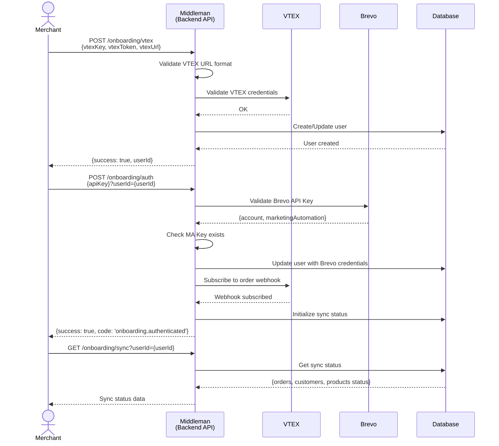
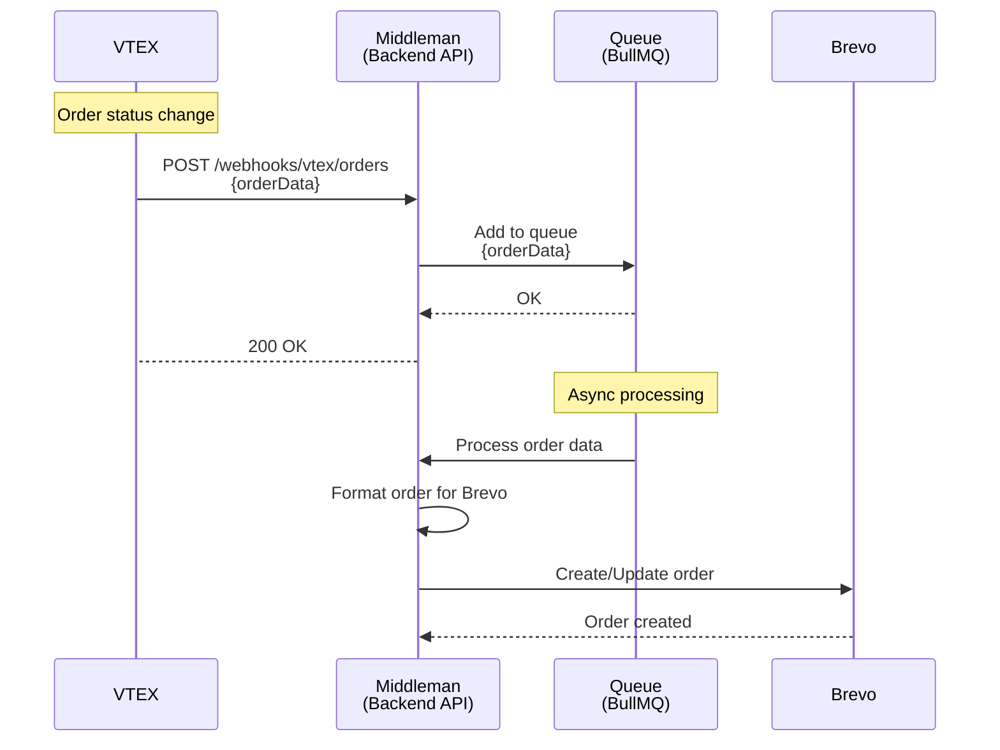
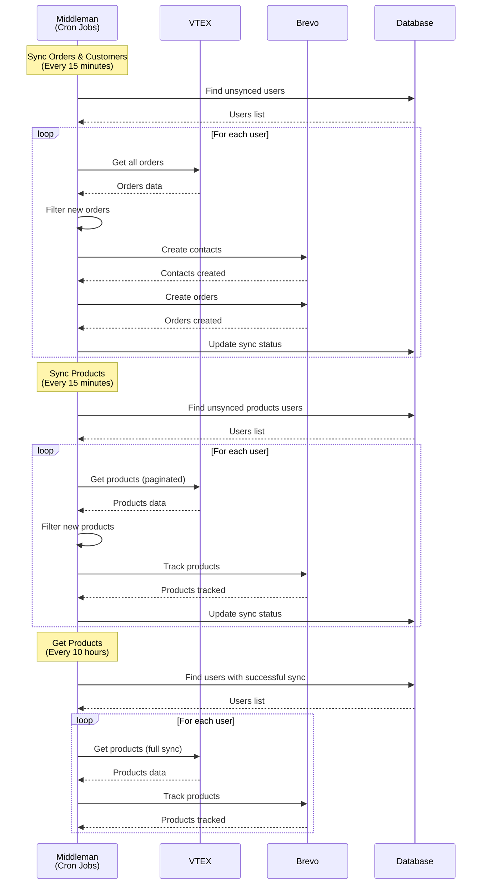

**Brevo-VTEX Integration**  

This project acts as an intelligent middleware that transforms and synchronizes data between VTEX and Brevo, enabling advanced digital marketing strategies and e-commerce campaign automation.

## Documentation

### API Documentation
**Backend API Reference**: [Brevo - Vtex - API](https://developers.brevo.com/)

### VTEX Connector Installation
**VTEX Connector Setup**: [Brevo VTEX Connector](https://es-brevo-vtex-docs.vercel.app/)

## Table of Contents

- [Tech Stack](#tech-stack)
- [Environment Variables](#environment-variables)
- [Installing Dependencies](#installing-dependencies)
- [Docker Compose (Development)](#docker-compose-development)
- [Running the Project](#running-the-project)
- [Project Structure](#project-structure)
- [API Endpoints](#api-endpoints)
- [Flow Diagrams](#flow-diagrams)
- [Middleware and Validations](#middleware-and-validations)
- [Error Handling](#error-handling)
- [Logging](#logging)
- [Lint and Prettier](#lint-and-prettier)

---

## Tech Stack

| Category                  | Technologies                                                                     |
|---------------------------|----------------------------------------------------------------------------------|
| **Server**                | Node.js (>=18.0.0), Express.js, TypeScript, MongoDB (Mongoose)           |
| **E-commerce Integration**| VTEX Package TS, Sendinblue SDK, Brevo API Integration                        |
| **Queue & Background Jobs**| BullMQ, Cron Jobs, Async Processing, Job Management                        |
| **Security & Middleware** | Helmet, XSS Protection, CORS, Express Rate Limiting, CryptoJS, express-mongo-sanitize, Conexa Core Server |
| **Logging & Monitoring**  | Winston, Conexa Core Server, Health Checks, Morgan                                     |
| **Development Tools**     | ESLint, Prettier, Husky, Jest (unit testing), Supertest (API testing), Nock (HTTP mocking), Commitizen |
| **Deployment**            | Docker, Kubernetes (Helm Charts), GitLab CI/CD                                           |

---

## Environment Variables

Configure the following variables in your environment (`.env`):

```bash
# Application Configuration
NODE_ENV=development
PORT=3000
API_URL="https://localhost:$PORT"
FRONTEND_URL="https://localhost:3000"

# Database Configuration
MONGODB_URL=mongodb://127.0.0.1:27017/brevo-vtex
CACHE_URL=redis://127.0.0.1:6379

# Security Configuration
CRYPTOJS_SECRET_KEY=your-secret-key-here

# Job Processing Limits
LIMIT_SYNC_ORDER=1
LIMIT_SYNC_PRODUCT=1
LIMIT_GET_PRODUCT=1
LIMIT_CLIENT_KEYS=1

# Kubernetes Configuration (Production)
POD_LABEL=your-pod-label
HOSTNAME=your-hostname
```

---

## Installing Dependencies

To install all dependencies, run:

```bash
yarn install-all
```

---

## Docker Compose (Development)

To run the project locally, you'll need **MongoDB** and **Redis**. Below is an example `docker-compose.yml` for your local setup:

> 📝 This file is not included in the repository. Create it manually based on your configuration.

```yaml
version: '3.8'

services:
  mongodb:
    image: mongo:latest
    ports:
      - '27017:27017'
    volumes:
      - ./data:/data/db

  mongo-express:
    image: mongo-express
    ports:
      - '8081:8081'
    environment:
      - ME_CONFIG_MONGODB_SERVER=mongodb
    depends_on:
      - mongodb
```

---

## Running the Project

Start the servers in development mode:

```bash
yarn dev
```

---

## Project Structure

```
.
├── src/                              # Source files
│   ├── config/                       # Configuration files
│   │   ├── app.ts                    # App configuration
│   │   └── config.ts                 # Environment variables validation
│   ├── controllers/                  # API Controllers
│   │   ├── onboarding.controller.ts  # Onboarding endpoints
│   │   ├── panel.controller.ts       # Panel management
│   │   ├── pixel-app.controller.ts   # Pixel app endpoints
│   │   └── webhooks.controller.ts    # Webhook handlers
│   ├── docs/                         # API Documentation
│   │   ├── postman-collection.json   # Postman collection
│   │   └── swagger-collection.json   # Swagger documentation
│   ├── interfaces/                   # TypeScript interfaces
│   │   ├── ecommerce.interfaces.ts   # E-commerce data interfaces
│   │   ├── elements.interfaces.ts    # Element tracking interfaces
│   │   ├── jobs.interfaces.ts        # Job processing interfaces
│   │   ├── user.interfaces.ts        # User data interfaces
│   │   └── vtex.interface.ts         # VTEX API interfaces
│   ├── jobs/                         # Background jobs and cron tasks
│   │   ├── manager/                  # Job management system
│   │   │   ├── factory.ts            # Job factory
│   │   │   └── index.ts              # Job manager
│   │   ├── get-products.ts           # Product fetching job
│   │   ├── maKeys.ts                 # Marketing keys sync
│   │   ├── sync-orders.ts            # Order synchronization
│   │   └── sync-products.ts          # Product synchronization
│   ├── lib/                          # Core libraries and utilities
│   │   ├── ApiError.ts               # Error handling
│   │   ├── constants.ts              # Application constants
│   │   ├── db.protection.ts          # Database protection
│   │   ├── pick.ts                   # Object utilities
│   │   ├── toJSON/                   # JSON serialization
│   │   └── utils.ts                  # General utilities
│   ├── middlewares/                  # Express middlewares
│   │   └── error.middleware.ts       # Error handling middleware
│   ├── models/                       # Mongoose models
│   │   ├── Elements.ts               # Element tracking model
│   │   └── User.ts                   # User model
│   ├── routes/                       # API routes
│   │   ├── index.routes.ts           # Main router
│   │   ├── onboarding.routes.ts      # Onboarding routes
│   │   ├── pixel-app.routes.ts       # Pixel app routes
│   │   ├── reports.routes.ts         # Reports routes
│   │   └── webhooks.routes.ts        # Webhook routes
│   ├── services/                     # Business logic services
│   │   ├── client.service.ts         # Brevo client service
│   │   ├── ecommerce.service.ts      # E-commerce utilities
│   │   ├── element.service.ts        # Element tracking service
│   │   ├── user.service.ts           # User management service
│   │   ├── vtex.service/             # VTEX integration service
│   │   │   ├── data-handled.service.ts # Data processing
│   │   │   ├── index.service.ts      # Main VTEX service
│   │   │   └── orders.service.ts     # Order processing
│   │   ├── webhooks/                 # Webhook services
│   │   │   └── orders/               # Order webhook handlers
│   │   │       ├── vtex.handler.ts   # VTEX webhook handler
│   │   │       └── vtex.service.ts   # VTEX webhook service
│   │   └── queues/                   # Queue management
│   │       ├── core/                 # Core queue functionality
│   │       ├── implementations/       # Queue implementations
│   │       └── types/                # Queue type definitions
│   ├── tests/                        # Test files
│   │   ├── __mocks__/                # Mock files
│   │   ├── e2e/                      # End-to-end tests
│   │   └── unit/                     # Unit tests
│   ├── utils/                        # Utility functions
│   │   └── cache.utils.ts            # Cache utilities
│   ├── validations/                  # Request validation schemas
│   │   ├── auth.validation.ts        # Authentication validation
│   │   ├── custom.validation.ts      # Custom validations
│   │   ├── onboarding.validation.ts  # Onboarding validation
│   │   ├── panel.validations.ts      # Panel validation
│   │   ├── pixelApp.validation.ts    # Pixel app validation
│   │   ├── user.validation.ts        # User validation
│   │   └── webhooks.validation.ts    # Webhook validation
│   ├── app.ts                        # Express app configuration
│   ├── index.ts                      # Application entry point
│   ├── custom.d.ts                   # Custom TypeScript declarations
│   └── declaration.d.ts              # TypeScript declarations
├── docs/                             # Project documentation
│   ├── bullmq-manager.md             # BullMQ manager documentation
│   └── queue-manager.md              # Queue manager documentation
├── dist/                             # Compiled JavaScript files
├── Dockerfile                        # Docker configuration
├── jest.config.cjs                   # Jest testing configuration
├── package.json                      # Project dependencies and scripts
├── sonar-project.properties          # SonarQube configuration
├── tsconfig.json                     # TypeScript configuration
├── yarn.lock                         # Yarn lock file
├── CHANGELOG.md                      # Changelog
├── TODO.md                           # Project todos
└── README.md                         # Project documentation
```

---

## API Endpoints

List of available routes (base path: `/api/v1`):

### Health Check Routes:

- `GET /` – Health check endpoint
- `GET /health` – Health check endpoint
- `GET /health-check` – Health check endpoint
- `GET /healthcheck` – Health check endpoint

### Onboarding Routes:

- `POST /onboarding/vtex` – VTEX integration setup and validation
- `POST /onboarding/auth` – Brevo authentication setup
- `GET /onboarding/sync` – Get synchronization status
- `POST /onboarding/resync` – Retry synchronization process

### Webhooks Routes:

- `POST /webhooks/vtex/orders` – Handle VTEX order webhooks

### Pixel App Routes:

- `POST /pixel-app/track-event` – Track e-commerce events

### Reports Routes:

- `GET /reports/client/health` – Brevo client health check
- `GET /reports/crons/health` – Cron jobs health status

---

## Flow Diagrams


### ONBOARDING:



### WEBHOOK:



### CRONS:


---

## Middleware and Validations

### Error Handling Middleware

```typescript
// src/middlewares/error.middleware.ts
export const errorConverter = (err: any, _req: Request, _res: Response, next: any) => {
  let error = err;
  if (!(error instanceof ApiError)) {
    const statusCode = error.statusCode || error instanceof mongoose.Error
      ? httpStatus.BAD_REQUEST
      : httpStatus.INTERNAL_SERVER_ERROR;
    let message: string = error.message || `${httpStatus[statusCode]}`;
    message = message.replaceAll('"', '');
    error = new ApiError(statusCode, message, '', false, err.stack);
  }
  next(error);
};

export const errorHandler = (err: ApiError, _req: Request, res: Response, _next: any) => {
  let { statusCode, message, code } = err;
  if (getConfig().env === 'production' && !err.isOperational) {
    statusCode = httpStatus.INTERNAL_SERVER_ERROR;
    message = 'Internal Server Error';
    code = 'internal-server-error';
  }

  const response = {
    success: err.success,
    statusCode,
    message: message || httpStatus[statusCode] || 'Unknown error',
    code: code || undefined,
    ...(getConfig().env === 'development' && { stack: err.stack }),
  };

  res.status(statusCode).send(response);
};
```

### Validations

#### Onboarding Validations

```typescript
// src/validations/onboarding.validation.ts
const vtex = {
  body: Joi.object().keys({
    vtexUrl: Joi.string().required(),
    vtexKey: Joi.string().required(),
    vtexToken: Joi.string().required(),
  }),
};

const authenticate = {
  query: Joi.object().keys({
    userId: Joi.string().required(),
  }),
  body: Joi.object().keys({
    apiKey: Joi.string().required(),
  }),
};

const sync = {
  query: Joi.object().keys({
    userId: Joi.string().required(),
  }),
};
```

#### Pixel App Validations

```typescript
// src/validations/pixelApp.validation.ts
export const pixelApp = {
  headers: {
    'api-key': Joi.string().required(),
  },
  body: Joi.object().keys({
    email: Joi.string().required(),
    event: Joi.string().required(),
    properties: Joi.object().required(),
  }),
};
```

#### Webhook Validations

```typescript
// src/validations/webhooks.validation.ts
const orderCreated = {
  body: Joi.object().keys({
    id: Joi.number().required(),
    store_id: Joi.number().required(),
    event: Joi.string().required(),
  }),
};
```

## Logging

### Logging System

The project uses the logging system from `conexa-core-server`, which is based on the [Winston](https://github.com/winstonjs/winston) library.

#### Logger Import

```typescript
import { Logger } from "conexa-core-server";
```

#### Severity Levels

```typescript
Logger.error("message"); // level 0 - Critical errors
Logger.warn("message"); // level 1 - Warnings
Logger.info("message"); // level 2 - General information
Logger.http("message"); // level 3 - HTTP request logs
Logger.verbose("message"); // level 4 - Detailed information
Logger.debug("message"); // level 5 - Debugging information
```

#### Modes of Operation

##### Development Mode

In development mode (`NODE_ENV=development`), all log levels are printed to the console.

##### Production Mode

In production mode (`NODE_ENV=production`), only info, warn, and error levels are printed to the console.

#### Configuration

The logging system is configured automatically based on the environment:

```typescript
// src/app.ts
configure({
  secretKey: getConfig().cryptojsKey,
  privateKey: getConfig().cryptojsKey,
  securityBypass: true, // getConfig().env !== 'production',
  debug: getConfig().env !== 'production',
  env: getConfig().env,
});
```

#### HTTP Logging

The project includes HTTP logging for web requests (only in non-test environments):

```typescript
// src/app.ts
if (getConfig().env !== 'test') {
  app.use(HttpLogger.successHandler);
  app.use(HttpLogger.errorHandler);
}
```

#### Application Logging

```typescript
// src/app.ts
Logger.debug(`Starting APP | Environment: ${getConfig().env}`);
```

---


### ESLint Configuration

ESLint configuration is located in `.eslintrc.json`. The project uses:

- `airbnb-base` and `airbnb-typescript/base` extends for TypeScript
- Plugins:
  - `jest` for testing
  - `security` for security
  - `prettier` for Prettier integration
- Custom TypeScript rules for `.ts` files

### Prettier Configuration

Prettier settings are in `.prettierrc.json`. Current configuration:

```json
{
  "parser": "typescript",
  "singleQuote": true,
  "trailingComma": "all",
  "printWidth": 110,
  "endOfLine": "auto",
  "tabWidth": 4
}
```

### Testing

The project uses Jest for testing with the following features:

- **Unit Tests**: Located in `src/tests/unit/`
- **E2E Tests**: Located in `src/tests/e2e/`
- **Mock Files**: Located in `src/tests/__mocks__/`
- **Test Setup**: `src/tests/setupTestDB.ts`

### Commit Standards

The project uses Commitizen for standardized commit messages:

```bash
yarn commit  # Interactive commit with conventional changelog
```

### Release Management

Automated release management with standard-version:

```bash
yarn release                # Create new release
yarn release:first          # First release
yarn release:minor          # Minor version bump
yarn release:patch          # Patch version bump
yarn release:major          # Major version bump
```
## License

[CONEXA]