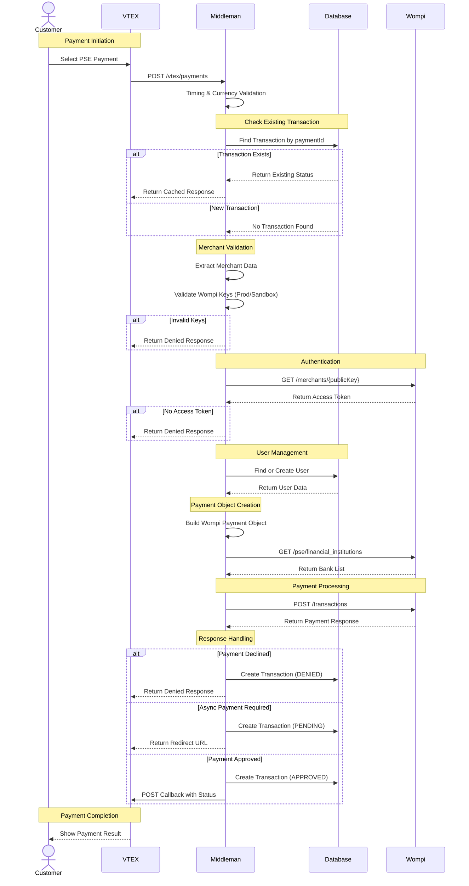
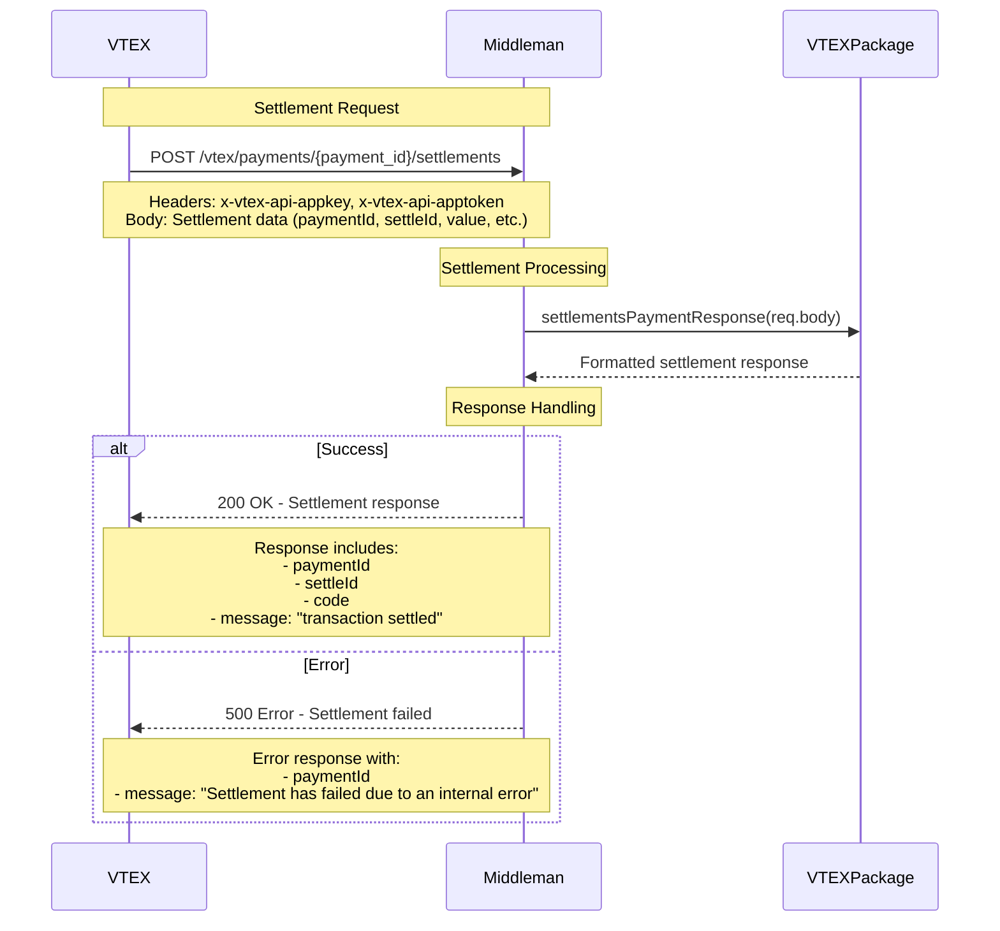
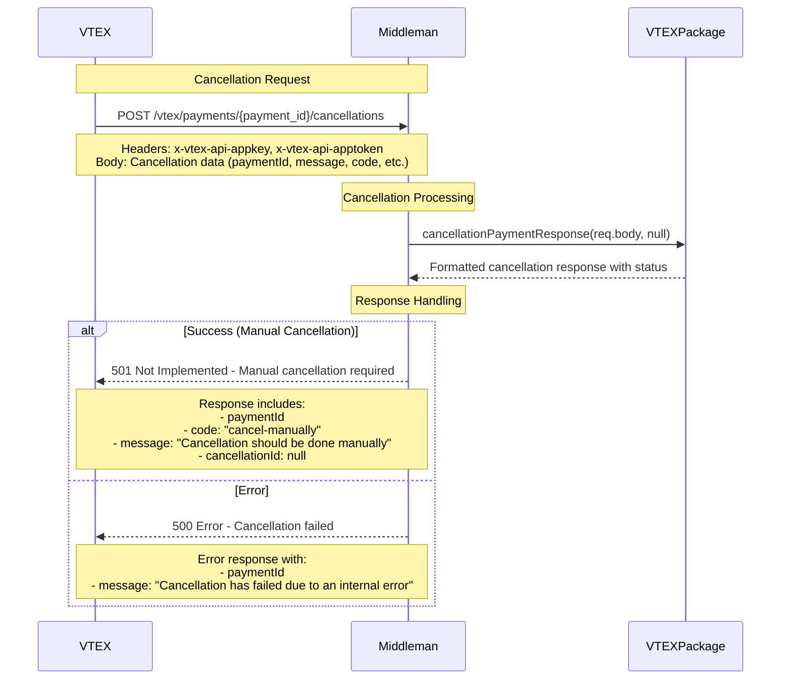
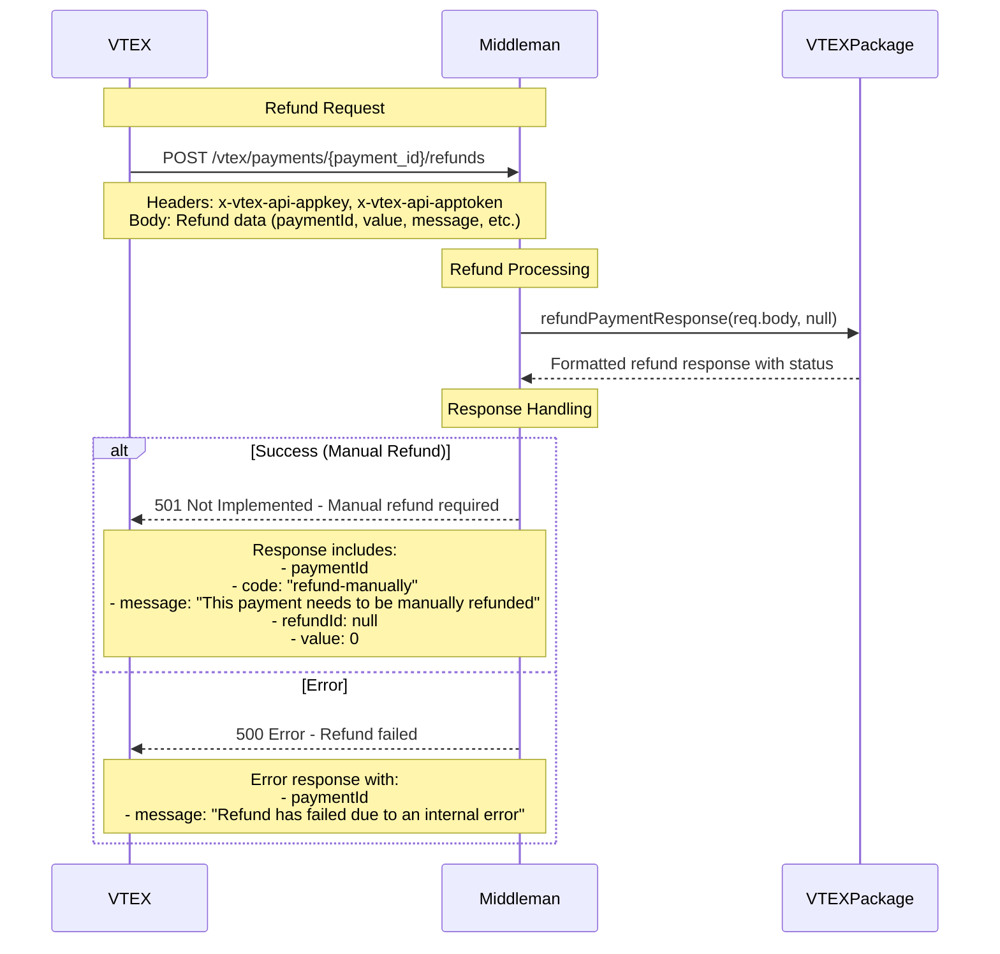

# Wompi PSE - VTEX

Middleman that integrates Wompi PSE payments with VTEX ecommerce

**Integration Docs**: [Wompi - Vtex - PSE](https://docs.wompi.co/)

## Table of Contents

- [Tech Stack](#tech-stack)
- [Environment Variables](#environment-variables)
- [Installing Dependencies](#installing-dependencies)
- [Docker Compose](#docker-compose)
- [Running the Project](#running-the-project)
- [Project Structure](#project-structure)
- [API Endpoints](#api-endpoints)
- [Flow Diagrams](#flow-diagrams)
- [Middleware and Validations](#middleware-and-validations)
- [Error Handling](#error-handling)
- [Logging](#logging)
- [Lint and Prettier](#lint-and-prettier)

---

## Tech Stack

| Category                  | Technologies                                                                     |
| ------------------------- | -------------------------------------------------------------------------------- |
| **Server**                | Node.js (v16-alpine), Express.js, MongoDB (Mongoose)                             |
| **Payment Integration**   | Wompi API , VTEX Payment Provider Interface, Axios for HTTP requests             |
| **Security & Middleware** | Crypto (SHA256 hashing), Express JSON parsing, Environment variables (dotenv)    |
| **Logging & Monitoring**  | Winston (structured logging), Health check endpoints, Request timing middleware  |
| **Development Tools**     | Jest (unit & integration testing), Nock (HTTP mocking), Nodemon (development)    |
| **Deployment**            | Docker (Node.js 16-alpine), Helm Charts (Kubernetes), Multi-environment configs  |
|                           | (stage/prod)                                                                     |
| **Database**              | MongoDB with Mongoose ODM, Indexed collections for transactions and users        |
| **Utilities**             | Country ISO conversion, Request timing middleware, Custom business logic modules |

## Environment Variables

The environment variables can be found and modified in the `.env.example` file. They come with these default values:

```bash
APP_PORT=2222
NODE_ENV=dev

APP_URL=https://wompi-vtex-pse-api-stage.conexa.ai

DB_URL=

WOMPI_URL=https://sandbox.wompi.co/v1
GET_BANKS_TOKEN=

WOMPI_PUBLIC_KEY=

VTEX_URL=https://wompi.myvtex.com/
VTEX_APPKEY=
VTEX_TOKEN=
MONITORING_TOKEN=
```

| Environment Variable | Description                   | Default Value                                |
| -------------------- | ----------------------------- | -------------------------------------------- |
| `APP_PORT`           | The port number of the server | `2222`                                       |
| `APP_URL`            | The base URL of the API       | `https://wompi-vtex-pse-api-stage.conexa.ai` |
| `VTEX_URL`           | The base URL for VTEX         | `https://wompi.myvtex.com/`                  |
| `VTEX_APPKEY`        | VTEX application API key      | ``                                           |
| `VTEX_TOKEN`         | VTEX application API token    | ``                                           |
| `DB_URL`             | MongoDB connection string     | `mongodb://127.0.0.1:27017/wompi-db`         |
| `WOMPI_URL`          | The base URL of the Wompi API | `https://sandbox.wompi.co/v1`                |
| `MONITORING_TOKEN`   | Monitoring service token      |                                              |

## Installing Dependencies

```bash
npm run install-all
```

## Docker Compose

To run the project locally, you'll need MongoD. Below is an example `docker-compose.yml` for your local setup:

📝 This file is not included in the repository. Create it manually based on your configuration.

```yaml
version: '3.8'

services:
  mongodb:
    image: mongo:latest
    ports:
      - '27017:27017'
    volumes:
      - ./data:/data/db

  mongo-express:
    image: mongo-express
    ports:
      - '8081:8081'
    environment:
      - ME_CONFIG_MONGODB_SERVER=mongodb
    depends_on:
      - mongodb
```

## Running the Project

Start the servers in development mode:

```bash
npm run dev
```

## Project Structure

```
├── src                               # Source files
│   ├── app.js                        # Express App configuration
│   ├── server.js                     # Application entry point
│   ├── config                        # Configuration files
│   │   ├── enviroment.js             # Environment variables and app config
│   │   └── paymentProvider.js        # Payment provider settings
│   ├── businessProcess               # Business logic layer
│   │   ├── db.businessProcess.js     # Database operations
│   │   ├── reports.service.js        # Report generation service
│   │   ├── vtex.bussines.js          # VTEX integration logic
│   │   └── wompi.bussines.js         # Wompi API integration
│   ├── controllers                   # Controllers
│   │   ├── ipn.controller.js         # Instant Payment Notification
│   │   ├── payments.controller.js    # Payment processing endpoints
│   │   ├── reports.controller.js     # Reports and monitoring
│   │   └── vitals.controller.js      # Health check endpoints
│   ├── middlewares                   # Middlewares
│   │   ├── currency.js               # Currency handling middleware
│   │   ├── report.js                 # Report middleware
│   │   └── timing.js                 # Request timing middleware
│   ├── models                        # Models (Mongoose)
│   │   ├── Transaction.model.js      # Transaction schema
│   │   └── User.model.js             # User schema
│   ├── routes                        # Routes
│   │   ├── index.routes.js           # Main router configuration
│   │   ├── ipn.routes.js             # IPN webhook routes
│   │   ├── reports.routes.js         # Report routes
│   │   ├── vitals.routes.js          # Health check routes
│   │   └── vtex.routes.js            # VTEX payment routes
│   ├── tests                         # Tests
│   │   ├── integration               # Integration tests
│   │   │   └── endToend.process.test.js # End-to-end tests
│   │   ├── mocks                     # Test mocks and fixtures
│   │   │   ├── credentials.js        # Mock credentials
│   │   │   ├── mockWompiApi.js       # Wompi API mocks
│   │   │   ├── mockWompiResponse.js  # Wompi response mocks
│   │   │   └── vtexPaymentData.js    # VTEX payment data mocks
│   │   ├── unit                      # Unit tests
│   │   │   ├── businessProcess       # Business logic tests
│   │   │   │   ├── db.bussines.test.js # Database tests
│   │   │   │   └── wompi.bussines.test.js # Wompi integration tests
│   │   │   └── controllers           # Controller tests
│   │   │       ├── ipn.controller.test.js # IPN controller tests
│   │   │       └── vtex-payments.controller.test.js # VTEX controller tests
│   │   └── setEnvVars.js             # Test environment setup
│   └── utils                         # Utility functions
│       ├── logger.js                 # Winston logging configuration
│       ├── reports.js                # Report utilities
│       └── utils.js                  # General utilities
├── Dockerfile                        # Docker container configuration
├── jest.config.js                    # Jest testing configuration
├── package.json                      # Project dependencies and scripts
├── package-lock.json                 # Dependency lock file
└── README.md                         # Project documentation
```

## API Endpoints

List of available routes (base path: `/api/v1`):

**VTEX Payment Routes:**

```bash
GET  /vtex/manifest                    # Get payment provider manifest
GET  /vtex/payment-methods             # Get available payment methods
POST /vtex/payments                    # Create payment transaction
POST /vtex/payments/:payment_id/settlements    # Process settlement
POST /vtex/payments/:payment_id/cancellations  # Cancel payment
POST /vtex/payments/:payment_id/refunds        # Process refund
GET  /vtex/banks                       # Get available banks
POST /vtex/payments/delay              # Simulate delayed callback response
```

**IPN (Instant Payment Notification) Routes:**

```bash
POST /ipn/event                        # Handle Wompi webhook events
```

**Reports Routes:**

```bash
GET  /reports/last-orders              # Get last orders (requires monitoring token)
GET  /reports/status-orders            # Get status orders (requires monitoring token)
GET  /reports/client/health            # Client health check
```

**Vitals Routes:**

```bash
GET  /vitals/ping                      # Service ping
GET  /vitals/dbcheck                   # Database connectivity check
```

**Health Check Routes:**

```bash
GET  /                                 # Health check
GET  /health                           # Health check
GET  /health-check                     # Health check
GET  /healthcheck                      # Health check
```

## Flow Diagrams

### Payments



### Settlements



### Cancellation



### Refunds



## Middleware and Validations

The project includes custom middleware to support request validation, monitoring access control, and performance tracking.

- 🔐 **ReportMiddleware**  
  Validates monitoring access using a Bearer token for report endpoints.  
  Authorization: Bearer `<monitoring-token>`

  ```js
  // Validates against MONITORING_TOKEN environment variable
  if (!authorization || authorization.split(' ')[1] !== MONITORING_TOKEN) {
  	return res.sendStatus(401);
  }
  ```

  Usage: Applied to `/api/v1/reports/*` endpoints for monitoring access control.

- 💰 **CurrencyMiddleware**  
  Validates that payment transactions use Colombian Peso (COP) currency.  
  Request Body: `{ currency: "COP" }`

  ```js
  // Validates currency is COP for payment requests
  if (currency !== 'COP') {
  	return res.status(200).json(
  		getResponseVtexDenied(
  			{
  				message: "The currency must be 'COP'"
  			},
  			paymentId
  		)
  	);
  }
  ```

  Usage: Applied to `/api/v1/vtex/payments` endpoint for currency validation.

- ⏱️ **TimingMiddleware**  
  Tracks request processing time and handles timeout scenarios for payment requests.  
  Features:

  - Measures request duration
  - Logs processing time
  - Handles 35-second timeout scenarios
  - Triggers timeout flow for long-running requests

  ```js
  // Tracks request timing and handles timeouts
  const startTime = Date.now();
  const checkResponseTimeout = async () => {
  	const elapsedTime = Date.now() - startTime;
  	if (elapsedTime >= 35000) {
  		// Handle timeout scenario
  	}
  };
  ```

  Usage: Applied to `/api/v1/vtex/payments` endpoint for performance monitoring.

- 🔧 **Global Middleware**  
  Applied globally in `app.js`:
  - `express.json()`: JSON request body parsing
  - Health check endpoints: `/`, `/health`, `/health-check`, `/healthcheck`

🔄 **Middleware Application Flow**

1. Global Middleware (`app.js`)
2. Route-specific Middleware (based on route configuration)
3. Controller Logic
4. Response handling

📍 **Route Middleware Mapping**

| Route                    | Middleware Applied                       |
| ------------------------ | ---------------------------------------- |
| `/api/v1/vtex/payments`  | `timingMiddleware`, `currencyMiddleware` |
| `/api/v1/vtex/*` (other) | None (public endpoints)                  |
| `/api/v1/ipn/*`          | None (webhook endpoints)                 |
| `/api/v1/reports/*`      | `reportMiddleware`                       |
| `/api/v1/vitals/*`       | None (health check endpoints)            |

🔍 **Middleware Configuration**

- **ReportMiddleware**: Uses `MONITORING_TOKEN` environment variable
- **CurrencyMiddleware**: Enforces COP currency for Colombian payments
- **TimingMiddleware**: 35-second timeout threshold for payment processing
- **Global Middleware**: Basic Express.js setup with health checks

## Logging

Import the logger from `conexa-core-server`. It uses the Winston logging library.

```js
import { Logger } from 'conexa-core-server';

Logger.error('message'); // level 0
Logger.warn('message'); // level 1
Logger.info('message'); // level 2
Logger.http('message'); // level 3
Logger.verbose('message'); // level 4
Logger.debug('message'); // level 5
```

In development mode, log messages of all severity levels are printed to the console.  
In production mode, only `info`, `warn`, and `error` logs are printed.

## Lint and Prettier

Linting is done using ESLint and Prettier.

To modify the ESLint configuration, update the `.eslintrc.js` file.  
To modify the Prettier configuration, update the `.prettierrc.json` file.

To prevent files or directories from being linted, add them to `.eslintignore` and `.prettierignore`.

## License

[CONEXA]
