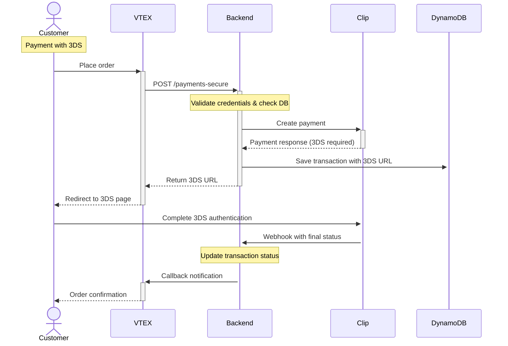
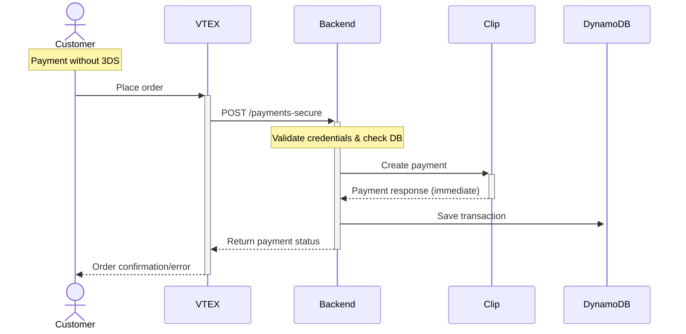
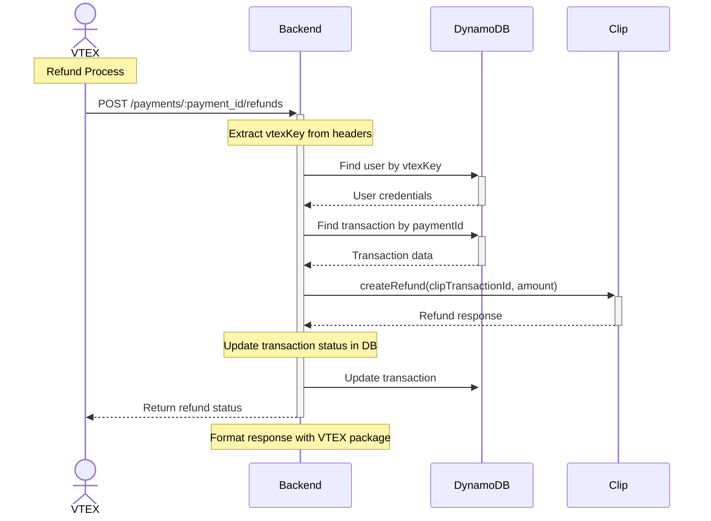

# CLIP - VTEX - NATIVE

This is a **transparent payment middleware** for VTEX e-commerce platform that integrates with Clip payment processor.

**Integration Docs**: [Clip - Vtex - Native](https://developer.clip.mx/reference/introduccion-al-checkout-transparente)

## Table of Contents

- [Tech Stack](#tech-stack)
- [Environment Variables](#environment-variables)
- [Installing Dependencies](#installing-dependencies)
- [Docker Compose](#docker-compose)
- [Running the Project](#running-the-project)
- [Project Structure](#project-structure)
- [API Endpoints](#api-endpoints)
- [Flow Diagrams](#flow-diagrams)
- [Middleware and Validations](#middleware-and-validations)
- [Error Handling](#error-handling)
- [Logging](#logging)
- [Testing](#testing)
- [Lint and Prettier](#lint-and-prettier)

---

## Tech Stack

| Category                  | Technologies                                                                     |
|---------------------------|----------------------------------------------------------------------------------|
| **Server**                | Node.js 18, Express.js, TypeScript, DynamoDB (Dynamoose)                        |
| **Payment Integration**   | Clip Native SDK, VTEX Package TS, VTEX Payment Provider Interface               |
| **Security & Middleware** | Helmet, XSS Protection, CORS, Express Rate Limiting, CryptoJS, express-mongo-sanitize |
| **Logging & Monitoring**  | Conexa Core Server, PM2, Health Checks, AWS SSM Parameter Store                |
| **Development Tools**     | ESLint, Prettier, Husky, Jest (unit testing), Supertest (API testing), Nock (HTTP mocking) |
| **Deployment**            | Docker, PM2, AWS Services (SSM, DynamoDB)                                       |

## Environment Variables

The following environment variables are required for the application:

```bash
NODE_ENV=
SCOPE=
PORT=
RATE_LIMIT=
DB_URL=
API_URL=
FRONTEND_URL=
SECRET_KEY=
PRIVATE_KEY=
ECOMMERCE_PUBLIC=
ECOMMERCE_SECRET=
ECOMMERCE_URL=
ECOMMERCE_UNIQUE_ID=
AWS_REGION=
DYNAMO_TRANSACTIONS_TABLE=
DYNAMO_USERS_TABLE=
AWS_SECRET_NAME=
```

| Environment Variable        | Description                                  | Required | Default |
| --------------------------- | -------------------------------------------- | -------- | ------- |
| `NODE_ENV`                 | The environment mode of the application      | No       | production |
| `SCOPE`                    | The deployment scope                         | Yes      | - |
| `PORT`                     | The port number of the server                | No       | 81 |
| `RATE_LIMIT`               | Rate limiting configuration                   | No       | 10000 |
| `DB_URL`                   | The MongoDB connection string                | Yes      | - |
| `API_URL`                  | The base URL of the API                      | Yes      | - |
| `FRONTEND_URL`             | The URL of the frontend application          | Yes      | - |
| `SECRET_KEY`               | The secret key for encryption operations     | Yes      | - |
| `PRIVATE_KEY`              | The client private key for Conexa Core       | Yes      | - |
| `ECOMMERCE_PUBLIC`         | VTEX application API key                     | Yes      | - |
| `ECOMMERCE_SECRET`         | VTEX application API token                   | Yes      | - |
| `ECOMMERCE_URL`            | VTEX application URL                         | Yes      | - |
| `ECOMMERCE_UNIQUE_ID`      | VTEX payment app name                        | Yes      | - |
| `AWS_REGION`               | AWS region for services                      | Yes      | - |
| `DYNAMO_TRANSACTIONS_TABLE`| DynamoDB transactions table name             | Yes      | dev_vtex_native_transactions |
| `DYNAMO_USERS_TABLE`       | DynamoDB users table name                    | Yes      | dev_vtex_native_users |
| `AWS_SECRET_NAME`          | AWS SSM parameter name for environment vars | No       | - |

## Installing Dependencies

```bash
yarn install-all
```

## Docker Compose

The project includes a `docker-compose.yml` file for local development with nginx configuration:

```yaml
version: "3.9"

networks:
  boilerplate-backend-network:
    driver: overlay

services:
  #Backend services
  boilerplate-backend:
    image: IMAGE_URI
    restart: unless-stopped
    working_dir: "/opt/app"
    networks:
      - boilerplate-backend-network

  #Nginx services
  webserver:
    image: nginx:latest
    environment:
      - PORT_SERVER_NAME: ${PORT_SERVER_NAME}
      - URL_SERVER_NAME: ${URL_SERVER_NAME}
    volumes:
      - ./deployment/nginx:/etc/nginx/conf.d
    working_dir: /var/www/html
    networks:
      - boilerplate-backend-network
    depends_on:
      - boilerplate-backend
    ports:
      - "${PORT_SERVER_NAME}:80"
```

## Running the Project

Start the servers in development mode:

```bash
yarn dev
```

## Project Structure

```
├── src                               # Source files
│   ├── config                        # Configuration files
│   │   ├── config.ts                 # Environment variables and app config
│   │   ├── app.ts                    # App configuration
│   │   ├── aws.ts                    # AWS services configuration
│   │   ├── constants.ts              # Application constants
│   │   ├── database.ts               # Database configuration
│   │   └── paymentProvider.ts        # Payment provider settings
│   ├── controllers                   # Controllers
│   │   ├── vtex.controller.ts        # VTEX payment endpoints
│   │   ├── ipn.controller.ts         # Instant Payment Notification
│   │   ├── front.controller.ts       # Frontend endpoints
│   │   └── vitals.controller.ts      # Health check endpoints
│   ├── interfaces                    # TypeScript interfaces
│   │   ├── payment.interface.ts      # Payment data structures
│   │   ├── transaction.interface.ts  # Transaction models
│   │   ├── user.interfaces.ts        # User data structures
│   │   ├── vtex.interfaces.ts        # VTEX-specific interfaces
│   │   ├── manifest.interface.ts     # Manifest interfaces
│   │   ├── client.interfaces.ts      # Client interfaces
│   │   └── index.ts                  # Interface exports
│   ├── lib                           # Library files
│   │   ├── vtex.ts                   # VTEX integration utilities
│   │   ├── provider.ts               # Payment provider utilities
│   │   ├── db.ts                     # Database utilities
│   │   ├── scripts/                  # Utility scripts
│   │   └── toJSON/                   # JSON conversion utilities
│   ├── middlewares                   # Middlewares
│   │   └── vtex.middleware.ts        # VTEX-specific middleware
│   ├── models                        # Models (Dynamoose)
│   │   ├── Transaction.model.ts      # Transaction schema
│   │   └── User.model.ts             # User schema
│   ├── routes                        # Routes
│   │   ├── index.routes.ts           # Main router configuration
│   │   ├── vtex.routes.ts            # VTEX payment routes
│   │   ├── ipn.routes.ts             # IPN webhook routes
│   │   ├── front.routes.ts           # Frontend routes
│   │   └── vitals.routes.ts          # Health check routes
│   ├── services                      # Services
│   │   ├── provider.service.ts       # Clip payment service
│   │   ├── vtex.service.ts           # VTEX integration service
│   │   └── database/                 # Database services
│   │       ├── transaction.service.ts # Transaction operations
│   │       └── user.service.ts       # User operations
│   ├── tests                         # Tests
│   │   ├── mocks/                    # Test mocks and fixtures
│   │   │   ├── api/                  # API mocks
│   │   │   ├── database/             # Database mocks
│   │   │   ├── provider/             # Provider mocks
│   │   │   └── vtex/                 # VTEX mocks
│   │   ├── __mocks__/                # Jest mocks
│   │   └── setupTestDB.ts            # Test database setup
│   ├── utils                         # Utility functions
│   │   ├── db.utils.ts               # Database utilities
│   │   ├── healthCheck.utils.ts      # Health check utilities
│   │   └── logger.ts                 # Logger utility
│   ├── validations                   # Validation schemas
│   │   ├── auth.validation.ts        # Authentication validation
│   │   ├── custom.validation.ts      # Custom validation rules
│   │   ├── front.validation.ts       # Frontend validation
│   │   ├── ipn.validation.ts         # IPN validation
│   │   └── user.validation.ts        # User validation
│   ├── app.ts                        # Express App configuration
│   ├── index.ts                      # Application entry point
│   ├── custom.d.ts                   # Custom TypeScript declarations
│   ├── declaration.d.ts              # Type declarations
│   └── path.ts                       # Path configuration
├── docs/                             # Documentation
│   ├── openapi.json                  # OpenAPI specification
│   ├── postman-collection.json       # Postman collection
│   └── swagger-collection.json       # Swagger documentation
├── deployment/                       # Deployment files
│   └── nginx/                        # Nginx configuration
├── Dockerfile                        # Docker configuration
├── docker-compose.yml                # Docker Compose setup
├── ecosystem.config.json             # PM2 configuration
├── jest.config.cjs                   # Jest test configuration
├── tsconfig.json                     # TypeScript configuration
└── README.md                         # Project documentation
```

## API Endpoints

List of available routes (base path: `/api/v1`):

**VTEX Payment Routes:**

```bash
GET  /api/v1/vtex/manifest                    # Get payment provider manifest
GET  /api/v1/vtex/payment-methods             # Get available payment methods
POST /api/v1/vtex/payments-secure             # Create payment transaction
POST /api/v1/vtex/payments/:payment_id/settlements    # Process settlement
POST /api/v1/vtex/payments/:payment_id/cancellations  # Cancel payment
POST /api/v1/vtex/payments/:payment_id/refunds        # Process refund
```

**IPN (Instant Payment Notification) Routes:**

```bash
POST /api/v1/ipn/clip                      # Handle Clip webhook events
```

**Frontend Routes:**

```bash
GET  /api/v1/front/get-payment-return/:vtexOrderId    # Get payment return status
```

**Health Check Routes:**

```bash
GET  /                                     # Health check (root endpoint)
GET  /health-check                         # Amazon health check
GET  /healthcheck                          # Basic health check
```

## Flow Diagrams

### Payments

#### Payment Flow with 3DS



#### Payment Flow without 3DS



### Refunds



## Middleware and Validations
The project includes custom middleware to support authentication, request validation, error handling, and monitoring access control.

- 🔐 **validateVtexKeys**  
  Validates VTEX API credentials for payment endpoints.  
  Headers: `x-vtex-api-appkey`, `x-vtex-api-apptoken`

  ```js
  // Validates VTEX credentials and merchant URL
  const { vtexKey, vtexToken } = vtexUtils.getAuthHeaders(headers);
  if (!vtexKey || !vtexToken) throw new CustomError('Invalid Credentials', CodeError.INVALID_AUTHORIZATION);
  
  const vtexUrl = vtexUtils.buildMerchantUrl(vtexKey);
  await vtexService.validateCredentials({ vtexKey, vtexToken, vtexUrl });
  ```
  Usage: Applied to `/api/v1/vtex/*` endpoints for VTEX authentication.

- 🛡️ **decryptRequestMiddleware** (from `conexa-core-server`)  
  External middleware from the Conexa Core Server library for request decryption.  
  Usage: Applied to routes with `security: true` flag in route configuration.

- ⚠️ **errorConverter**  
  Converts various error types to standardized ApiError format with proper HTTP status codes.  
  **Features:**
  - Converts Dynamoose errors to `400 Bad Request`
  - Handles validation errors with message cleanup
  - Generates error codes from error messages
  - Preserves stack traces in development

- 🚨 **errorHandler**  
  Handles final error responses with environment-specific behavior.  
  **Features:**
  - Masks internal errors in production
  - Includes stack traces in development
  - Standardizes error response format
  - Logs errors in development mode

- 🔧 **Global Security Middleware**  
  Applied globally in `app.ts`:  
  - `helmet`: Security HTTP headers  
  - `cors`: Cross-origin resource sharing  
  - `xss`: XSS protection  
  - `express-mongo-sanitize`: MongoDB injection protection  
  - `compression`: Gzip compression  
  - `rateLimit`: Rate limiting (5 minutes window, configurable limit)
  - `HttpLogger`: Request/response logging (non-test environments)

- 📋 **Validation Middleware**  
  Uses Joi schemas for request validation:
  - `auth.validation.ts`: Authentication validation
  - `custom.validation.ts`: Custom validation rules (objectId, phone regex)
  - `front.validation.ts`: Frontend validation
  - `ipn.validation.ts`: IPN validation
  - `user.validation.ts`: User validation

🔄 **Middleware Application Flow**
1. Global Security Middleware (`app.ts`)
2. Route-specific Middleware (based on route configuration)
3. Controller Logic
4. Error Conversion (`errorConverter`)
5. Error Handling (`errorHandler`)

📍 **Route Middleware Mapping**

| Route                | Middleware Applied           |
| -------------------- | ---------------------------- |
| `/api/v1/vtex/*`     | `validateVtexKeys`           |
| `/api/v1/ipn/*`      | None (public webhook endpoints) |
| `/api/v1/front/*`    | `decryptRequestMiddleware` + `validateMiddleware` |
| `/` (health)         | None (public health check)  |

## Error Handling

The application uses a comprehensive error handling system:

- **CustomError**: Custom error class for application-specific errors
- **CodeError**: Standardized error codes
- **errorConverter**: Converts various error types to standardized format
- **errorHandler**: Final error response handler with environment-specific behavior

## Logging

The project uses Winston logging library through `conexa-core-server`.

```js
import { Logger } from 'conexa-core-server';

Logger.error('message'); // level 0
Logger.warn('message');  // level 1
Logger.info('message');  // level 2
Logger.http('message');  // level 3
Logger.verbose('message'); // level 4
Logger.debug('message'); // level 5
```

**Log Levels by Environment:**
- **Development**: All log levels are printed to console
- **Production**: Only `info`, `warn`, and `error` logs are printed

## Testing

The project includes comprehensive testing setup with Jest:

```bash
# Run all tests
yarn test

# Run TypeScript tests only
yarn test:ts

# Run JavaScript tests only
yarn test:js

# Run tests in watch mode
yarn test:watch

# Generate coverage report
yarn coverage
```

**Test Structure:**
- **Unit Tests**: Individual component testing
- **Integration Tests**: API endpoint testing
- **Mock Files**: Comprehensive mock data for testing
- **Test Database**: Isolated test database setup

## Lint and Prettier

Code quality is maintained using ESLint and Prettier.

**Configuration Files:**
- `.eslintrc.js`: ESLint rules and settings
- `.prettierrc.json`: Prettier formatting rules

**Ignore Files:**
- `.eslintignore`: Files/directories excluded from linting
- `.prettierignore`: Files/directories excluded from formatting

**Available Scripts:**
```bash
yarn lint              # Run ESLint
yarn lint:fix          # Run ESLint with auto-fix
yarn prettier          # Check Prettier formatting
yarn prettier:fix      # Fix Prettier formatting
```

## License

[CONEXA]