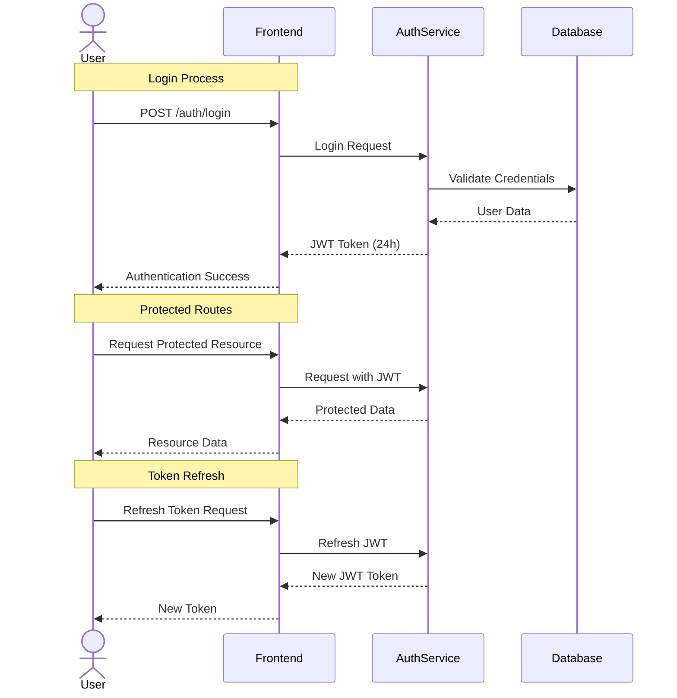
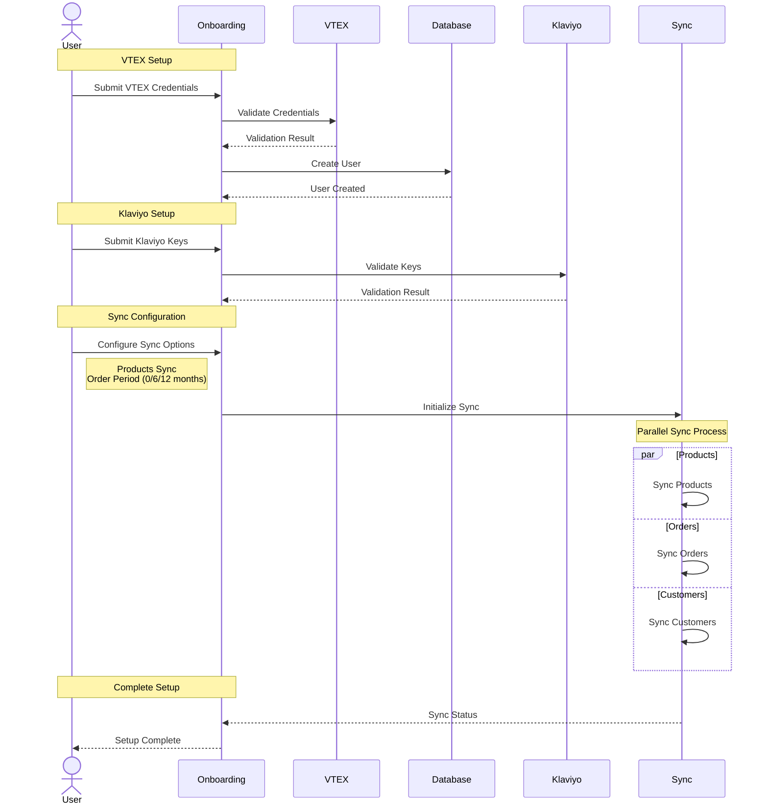
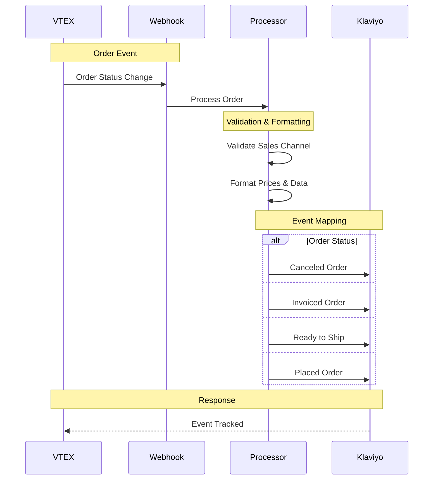

# Carrier VTEX Service

**Klaviyo-VTEX Integration**\
This project is a backend integration that connects VTEX (e-commerce platform) with Klaviyo (email marketing and automation platform), enabling two-way data synchronization between the two platforms.

## Table of Contents

- [Tech Stack](#tech-stack)
- [Environment Variables](#environment-variables)
- [Installing Dependencies](#installing-dependencies)
- [Docker Compose (Development)](#docker-compose-development)
- [Running the Project](#running-the-project)
- [Project Structure](#project-structure)
- [API Endpoints](#api-endpoints)
- [Flow Diagrams](#flow-diagrams)
- [Middleware and Validations](#middleware-and-validations)
- [Error Handling](#error-handling)
- [Logging](#logging)
- [Lint and Prettier](#lint-and-prettier)

---

## Tech Stack

**Server:**

- **Node.js** (v18, as per Dockerfile)
- **Express.js** (Web framework)
- **TypeScript** (Programming language)
- **MongoDB** (Mongoose as ODM)

---

## Environment Variables

Configure the following variables in your environment (`.env`):

```bash
PORT=5420
NODE_ENV=development

API_URL="https://localhost:$PORT"
FRONTEND_URL="https://localhost:3000"
KLAVIYO_API_URL=https://a.klaviyo.com/api

CRYPTOJS_SECRET_KEY=123456

MONGODB_URL=mongodb://127.0.0.1:27017/carrier-vtex

JWT_SECRET=myVerySecretString

NUMBER_OF_BATCH_FOR_ORDERS_CRON=20
NUMBER_OF_BATCH_FOR_PRODUCTS_CRON=100
```

---

## Installing Dependencies

To install all dependencies, run:

```bash
yarn install-all
```

---

## Docker Compose (Development)

To run the project locally, you'll need **MongoDB** and **Redis**. Below is an example `docker-compose.yml` for your local setup:

> 📝 This file is not included in the repository. Create it manually based on your configuration.

```yaml
version: '3.9'

networks:
  klaviyovtex:
    driver: overlay

services:
  mongodb:
    image: mongo:latest
    ports:
      - '27017:27017'
    volumes:
      - ./data/db:/data/db

  redis:
    image: redis:latest
    ports:
      - '6379:6379'
    volumes:
      - redis_data:/data

  app:
    image: IMAGE_URI
    working_dir: /opt/app
    networks:
      - klaviyovtex
    ports:
      - "9001:3000"

volumes:
  redis_data:
    driver: local
```

---

## Running the Project

Start the servers in development mode:

```bash
npm run start-dev
```

---

## Project Structure

```
.
├── src/                              # Source files
│   ├── config/                       # Configuration files
│   ├── constants/                    # Constants
│   ├── controllers/                  # Controllers
│   ├── docs/                         # Documentation files
│   ├── enums/                        # TypeScript enums
│   ├── interfaces/                   # TypeScript interfaces
│   ├── jobs/                         # Background jobs and cron tasks
│   ├── lib/                          # Core libraries and utilities
│   ├── middlewares/                  # Express middlewares
│   ├── models/                       # Mongoose models
│   ├── routes/                       # API routes
│   ├── services/                     # Business logic services
│   ├── tests/                        # Test files
│   ├── utils/                        # Utility functions
│   ├── validations/                  # Request validation schemas
│   ├── app.ts                        # Express app configuration
│   ├── index.ts                      # Application entry point
│   ├── custom.d.ts                   # Custom TypeScript declarations
│   └── declaration.d.ts              # TypeScript declarations
├── deployment/                       # Deployment configurations
│   └── docker-compose.yml            # Production docker-compose
├── dist/                             # Compiled JavaScript files
├── .github/                          # GitHub configurations
├── .husky/                           # Git hooks
├── .vscode/                          # VS Code configurations
├── docker-compose.yml                # Development docker-compose
├── Dockerfile                        # Docker configuration
├── Jenkinsfile                       # CI/CD pipeline configuration
├── ecosystem.config.json             # PM2 configuration
├── jest.config.cjs                   # Jest testing configuration
├── package.json                      # Project dependencies and scripts
├── tsconfig.json                     # TypeScript configuration
├── .commitlintrc.json                # Commit linting rules
├── .dockerignore                     # Docker ignore rules
├── .editorconfig                     # Editor configuration
├── .eslintignore                     # ESLint ignore rules
├── .eslintrc.json                    # ESLint configuration
├── .gitattributes                    # Git attributes
├── .gitignore                        # Git ignore rules
├── .lintstagedrc                     # Lint-staged configuration
├── .npmrc                            # NPM configuration
├── .prettierignore                   # Prettier ignore rules
├── .prettierrc.json                  # Prettier configuration
├── .versionrc                        # Version configuration
├── CHANGELOG.md                      # Changelog
├── README.md                         # Project documentation
└── TODO.md                           # Project todos
```

---

## API Endpoints

List of available routes (base path: `/api/v1`):

### Auth Routes:

- `POST /auth/login` – User authentication
- `POST /auth/refresh-token` – Refresh authentication token

### Onboarding Routes:

- `POST /onboarding/vtex` – VTEX integration setup
- `GET /onboarding/vtex/sales-channel` – Get VTEX sales channels
- `POST /onboarding/vtex/sales-channel` – Set VTEX sales channel
- `GET /onboarding/timezone` – Get available timezones
- `POST /onboarding/auth` – Authentication setup
- `GET /onboarding/sync` – Get sync status
- `POST /onboarding/resync` – Retry synchronization

### Webhooks Routes:

- `POST /webhooks/vtex/orders` – Handle VTEX order webhooks
- `POST /webhooks/vtex/products` – Handle VTEX product webhooks

### Support Routes:

- `GET /support/account-status` – Get account status

### Jobs Routes:

- `GET /jobs` – Get jobs status

### Vitals Routes:

- `GET /` – Health check endpoint

---

## Flow Diagrams

### AUTH:



### ONBOARDING:



### WEBHOOK:



---

## Middleware and Validations

### verifyToken Middleware

```typescript
// src/middlewares/verifyToken.middleware.ts
export const verifyToken: RequestHandler = (req, _res, next) => {
    try {
        const token = req.headers.authorization?.split(' ')[1];
        if (!token) throw new Error('Token not present in the request header.');

        const decodedToken = jwt.verify(token, config.jwtSecret);
        if (typeof decodedToken === 'object') {
            const content = decodedToken as IMiddlemanTokenContent;
            req.userId = content.userId;
        }
        next();
    } catch (error) {
        next(new ApiError(httpStatus.UNAUTHORIZED, 'Se detectó un problema con la autenticación'));
    }
};
```

### Validations

#### Auth Validations

```typescript
// src/validations/auth.validation.ts
export const login = {
    body: Joi.object().keys({
        // ... esquema de validación para login
    }),
};
```

#### Onboarding Validations

```typescript
// src/validations/onboarding.validation.ts
export const vtex = {
    body: Joi.object().keys({
        // ... esquema de validación para VTEX
    }),
};
```

#### Account Status Validations

```typescript
// src/validations/accountStatus.validation.ts
export const getAccountStatus = {
    query: Joi.object().keys({
        // ... esquema de validación para estado de cuenta
    }),
};
```

---

## Error Handling

```typescript
// src/middlewares/error.middleware.ts
export const errorHandler: ErrorRequestHandler = (err, _req, res, _next) => {
    const { code } = err;
    let { message } = err;
    const statusCode = err.statusCode || httpStatus.INTERNAL_SERVER_ERROR;
    // ... manejo de errores
};
```

---

## Logging

# Logging System

El proyecto utiliza el sistema de logging de `conexa-core-server`, que está basado en la biblioteca [Winston](https://github.com/winstonjs/winston).

## Importación del Logger

```typescript
import { Logger } from 'conexa-core-server';
```

## Niveles de Severidad

Los logs deben realizarse según los siguientes niveles de severidad (en orden ascendente, del más importante al menos importante):

```typescript
Logger.error('message'); // level 0 - Errores críticos
Logger.warn('message');  // level 1 - Advertencias
Logger.info('message');  // level 2 - Información general
Logger.http('message');  // level 3 - Logs de peticiones HTTP
Logger.verbose('message'); // level 4 - Información detallada
Logger.debug('message'); // level 5 - Información de depuración
```

## Modos de Operación

### Modo Desarrollo

En modo desarrollo (`NODE_ENV=development`), se imprimen en consola todos los niveles de log.

### Modo Producción

En modo producción (`NODE_ENV=production`), solo se imprimen en consola los logs de nivel info, warn y error.

## Configuración

El sistema de logging está configurado automáticamente según el entorno:

```typescript
// src/app.ts
conexaCore.configure({
    secretKey: config.cryptojsKey,
    securityBypass: config.env !== 'production',
    debug: config.env !== 'production',
    env: config.env,
});
```

## Logging HTTP

El proyecto incluye un logger HTTP específico para las peticiones web:

```typescript
// src/app.ts
app.use(conexaCore.HttpLogger.errorHandler);
```

---

## Lint and Prettier

El proyecto utiliza ESLint y Prettier para mantener la calidad y consistencia del código.

### Configuración de ESLint

La configuración de ESLint se encuentra en `.eslintrc.json`. El proyecto utiliza:

- Extensión de `airbnb-base` y `airbnb-typescript/base` para TypeScript
- Plugins:
  - `jest` para testing
  - `security` para seguridad
  - `prettier` para integración con Prettier
- Reglas personalizadas para TypeScript en archivos `.ts`

Para modificar la configuración de ESLint, actualiza el archivo `.eslintrc.json`.

### Configuración de Prettier

La configuración de Prettier se encuentra en `.prettierrc.json`. Configuración actual:

```json
{
  "parser": "typescript",
  "singleQuote": true,
  "trailingComma": "all",
  "printWidth": 110,
  "endOfLine": "auto",
  "tabWidth": 4
}
```

