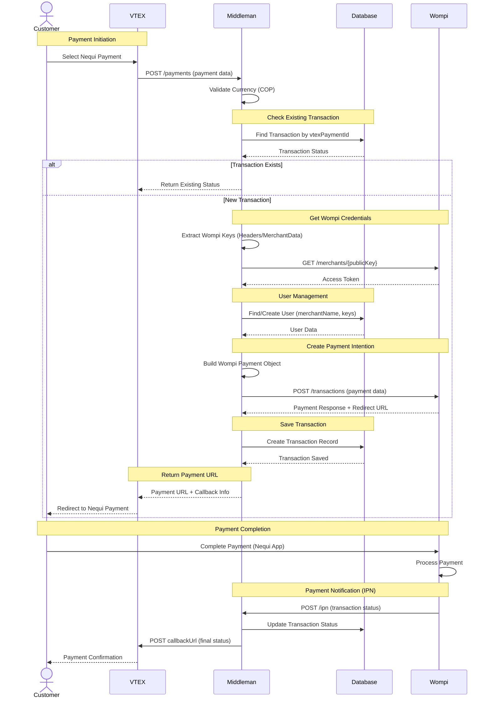
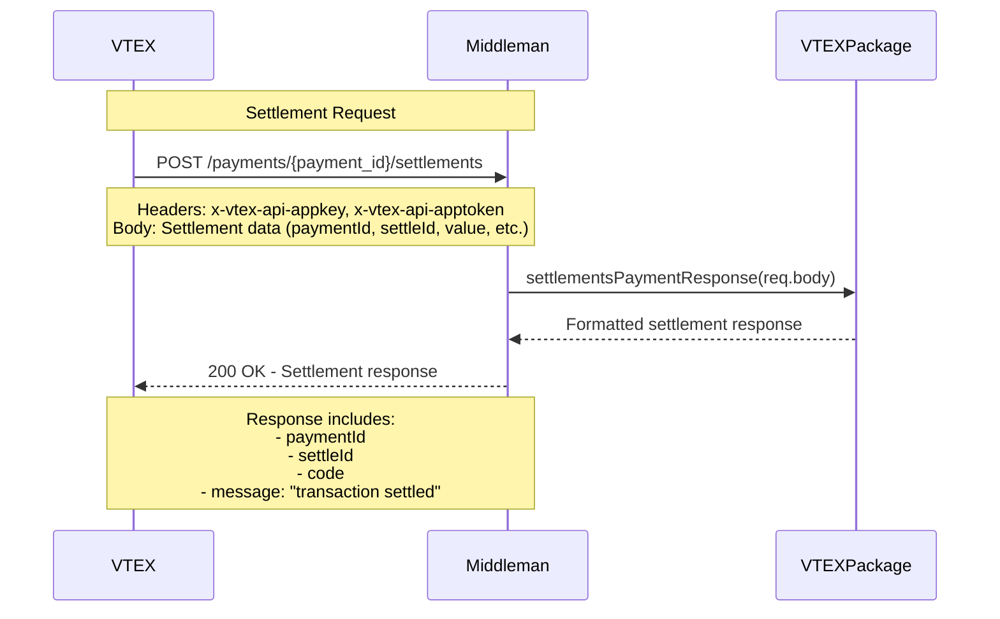
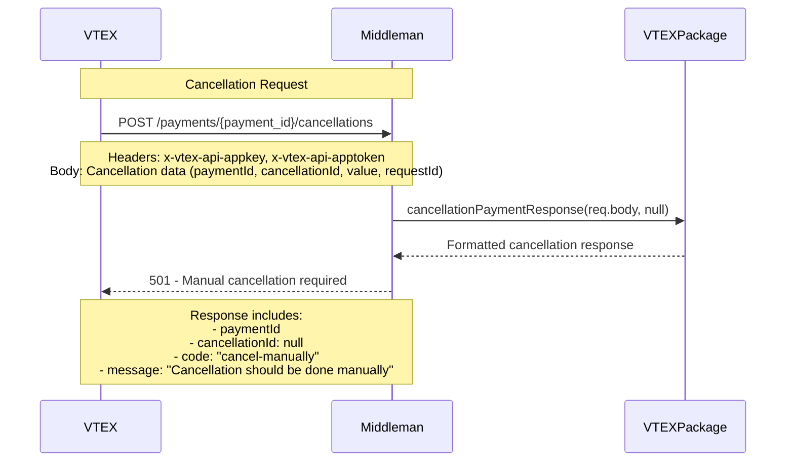
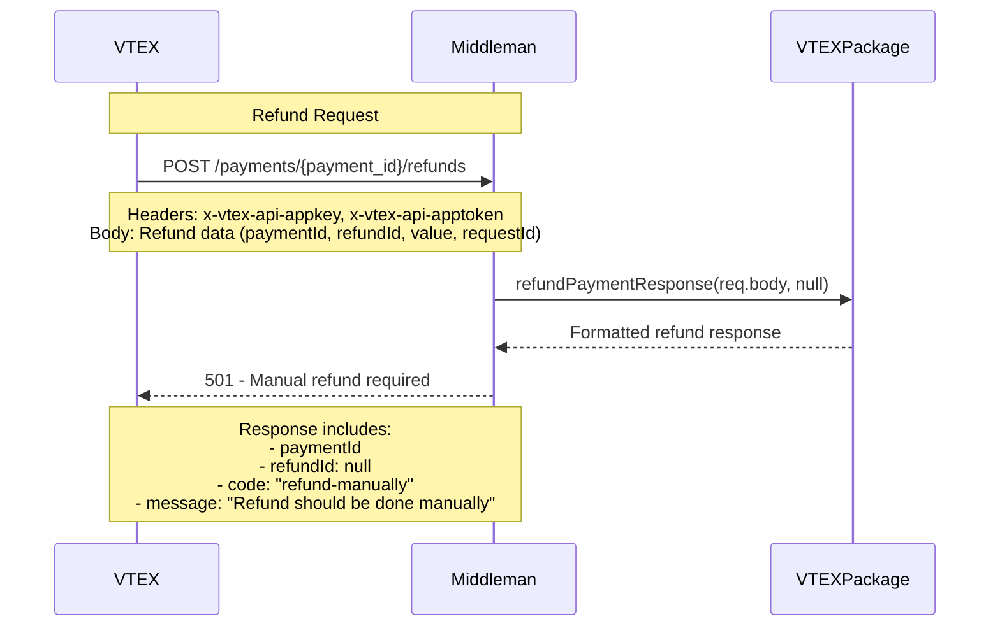

# Wompi - VTEX - NEQUI

This is a backend payment connector that integrates VTEX e-commerce platform with Wompi (Bancolombia's payment processor) for processing bank transfers in Colombia.

**Integration Docs**: [Wompi - Vtex - Nequi](https://docs.wompi.co/)

## Table of Contents

- [Tech Stack](#tech-stack)
- [Environment Variables](#environment-variables)
- [Installing Dependencies](#installing-dependencies)
- [Docker Compose](#docker-compose)
- [Running the Project](#running-the-project)
- [Project Structure](#project-structure)
- [API Endpoints](#api-endpoints)
- [Flow Diagrams](#flow-diagrams)
- [Middleware and Validations](#middleware-and-validations)
- [Error Handling](#error-handling)
- [Logging](#logging)
- [Lint and Prettier](#lint-and-prettier)

---

## Tech Stack

| Category                  | Technologies                                                               |
| ------------------------- | -------------------------------------------------------------------------- |
| **Server**                | Node.js (v16-alpine), Express.js, MongoDB (Mongoose)                       |
| **Payment Integration**   | Wompi API (Bancolombia), VTEX Payment Provider Interface                   |
| **Security & Middleware** | CORS, Crypto (Node.js built-in), Express JSON parsing                      |
| **Logging & Monitoring**  | Winston, Health Checks                                                     |
| **Development Tools**     | Jest (unit testing), Supertest (API testing), Nock (HTTP mocking), Nodemon |
| **Deployment**            | Docker, Kubernetes (Helm charts)                                           |

## Environment Variables

The environment variables can be found and modified in the `.env.example` file. They come with these default values:

```bash
APP_PORT=5420
APP_URL=https://wompi-vtex-nequi-api.conexa.ai

VTEX_URL=https://wompi.myvtex.com/
VTEX_APPKEY=vtexappkey-wompi-TLTBUI
VTEX_TOKEN=XNIVVSZNEBTYITACKAIOQVLHGVZIQHIQVGLHNSDPCEBYPGNOLNXYBUCWJYBLBVQMPYMZZTWPQGTUGDDGAKKPLHIUSQLTORXCIGPZOCEACVMQNPTJFUHSGYIJTHGJJXOM
DB_URL=mongodb://127.0.0.1:27017/wompi-db

WOMPI_URL=https://sandbox.wompi.co/v1

MONITORING_TOKEN=
```

| Environment Variable | Description                   | Default Value                            |
| -------------------- | ----------------------------- | ---------------------------------------- |
| `APP_PORT`           | The port number of the server | `5420`                                   |
| `APP_URL`            | The base URL of the API       | `https://wompi-vtex-nequi-api.conexa.ai` |
| `VTEX_URL`           | The base URL for VTEX         | `https://wompi.myvtex.com/`              |
| `VTEX_APPKEY`        | VTEX application API key      | `vtexappkey-wompi-TLTBUI`                |
| `VTEX_TOKEN`         | VTEX application API token    | `XNIVVSZNEBTY…`                          |
| `DB_URL`             | MongoDB connection string     | `mongodb://127.0.0.1:27017/wompi-db`     |
| `WOMPI_URL`          | The base URL of the Wompi API | `https://sandbox.wompi.co/v1`            |
| `MONITORING_TOKEN`   | Monitoring service token      |                                          |

## Installing Dependencies

```bash
npm run install-all
```

## Docker Compose

To run the project locally, you'll need MongoD. Below is an example `docker-compose.yml` for your local setup:

📝 This file is not included in the repository. Create it manually based on your configuration.

```yaml
version: '3.8'

services:
  mongodb:
    image: mongo:latest
    ports:
      - '27017:27017'
    volumes:
      - ./data:/data/db

  mongo-express:
    image: mongo-express
    ports:
      - '8081:8081'
    environment:
      - ME_CONFIG_MONGODB_SERVER=mongodb
    depends_on:
      - mongodb
```

## Running the Project

Start the servers in development mode:

```bash
npm run dev
```

## Project Structure

```
├── automation/                        # Kubernetes deployment files
│   ├── templates/                     # Helm chart templates
│   │   ├── deployment.yaml            # Kubernetes deployment configuration
│   │   ├── hpa.yaml                   # Horizontal Pod Autoscaler
│   │   ├── ingress.yaml               # Ingress configuration
│   │   └── service.yaml               # Service configuration
│   ├── Chart.yaml                     # Helm chart metadata
│   ├── values-prod.yaml               # Production environment values
│   └── values-stage.yaml              # Staging environment values
├── src/                               # Source files
│   ├── businessProcess/               # Business logic layer
│   │   ├── db.bussines.js             # Database operations
│   │   ├── reports.service.js         # Report generation service
│   │   ├── utils.bussines.js          # Business utilities
│   │   ├── vtex.bussines.js           # VTEX integration logic
│   │   └── wompi.bussines.js          # Wompi payment integration
│   ├── controllers/                   # Controllers
│   │   ├── ipn.controller.js          # Instant Payment Notification
│   │   ├── reports.controller.js      # Reports and monitoring
│   │   └── vtex-payments.controller.js # VTEX payment endpoints
│   ├── middleware/                    # Middlewares
│   │   ├── currency.js                # Currency handling middleware
│   │   └── report.js                  # Report middleware
│   ├── models/                        # Models (Mongoose)
│   │   ├── Transaction.model.js       # Transaction schema
│   │   └── User.model.js              # User schema
│   ├── paymentProvider/               # Payment provider configuration
│   │   └── paymentProvider.js         # Payment provider settings
│   ├── routes/                        # Routes
│   │   ├── index.routes.js            # Main router configuration
│   │   ├── ipn.routes.js              # IPN webhook routes
│   │   ├── reports.routes.js          # Report routes
│   │   └── vtex-payments.routes.js    # VTEX payment routes
│   ├── tests/                         # Tests
│   │   ├── integration/               # Integration tests
│   │   │   └── endToend.process.test.js # End-to-end tests
│   │   ├── mocks/                     # Test mocks and fixtures
│   │   │   ├── credentials.js         # Mock credentials
│   │   │   ├── mockWompiApi.js        # Mock Wompi API responses
│   │   │   ├── mockWompiResponse.js   # Mock Wompi responses
│   │   │   └── vtexPaymentData.js     # Mock VTEX payment data
│   │   ├── unit/                      # Unit tests
│   │   │   ├── businessProcess/       # Business logic tests
│   │   │   └── controllers/           # Controller tests
│   │   └── setEnvVars.js              # Test environment setup
│   ├── utils/                         # Utility functions
│   │   ├── constants/                 # Constants
│   │   │   └── enviroment.js          # Environment variables
│   │   ├── logger.js                  # Winston logging configuration
│   │   ├── reports.js                 # Report utilities
│   │   ├── utils.js                   # General utilities
│   │   └── vtex.js                    # VTEX utilities
│   ├── app.js                         # Express App configuration
│   └── server.js                      # Application entry point
├── Dockerfile                         # Docker container configuration
├── jest.config.js                     # Jest testing configuration
├── package.json                       # Node.js dependencies and scripts
├── package-lock.json                  # Dependency lock file
├── readme.md                          # Project documentation
├── README2.md                         # Additional documentation
└── .gitignore                         # Git ignore patterns
```

## API Endpoints

List of available routes (base path: `/`):

**VTEX Payment Routes:**

````bash
GET  /vtex/manifest                    # Get payment provider manifest
GET  /vtex/payment-methods             # Get available payment methods
POST /vtex/payments                    # Create payment transaction
POST /vtex/payments/:payment_id/settlements    # Process settlement
POST /vtex/payments/:payment_id/cancellations  # Cancel payment
POST /vtex/payments/:payment_id/refunds        # Process refund

**IPN (Instant Payment Notification) Routes:**

```bash
POST /ipn/event                        # Handle Wompi webhook events
````

**Reports Routes:**

```bash
GET  /reports/last-orders              # Get last orders
GET  /reports/status-orders            # Get status orders
GET  /reports/client/health            # Client health check
```

**Health Check Routes:**

```bash
GET  /                                 # Health check
GET  /health                           # Health check
GET  /healthcheck                      # Health check
GET  /health-check                     # Health check
```

## Flow Diagrams

### Payments



### Settlements



### Cancellation



### Refunds



## Middleware and Validations

The project includes custom middleware to support authentication, request validation, error handling, and monitoring access control.

- 🔐 **ReportMiddleware**  
  Validates monitoring access using a Bearer token for report endpoints.  
  Authorization: Bearer `<monitoring-token>`

  ```js
  // Validates against MONITORING_TOKEN environment variable
  if (!authorization || authorization.split(' ')[1] !== MONITORING_TOKEN) {
  	return res.sendStatus(401);
  }
  ```

  Usage: Applied to `/reports/*` endpoints for monitoring access control.

- 💰 **CurrencyMiddleware**  
  Validates that payment requests use Colombian Peso (COP) currency.  
  Request Body Validation: `currency === 'COP'`

  ```js
  // Validates currency in request body
  if (currency !== 'COP') {
  	logger.warn(`Payment ID ${paymentId} is not a valid currency: ${currency}`);
  	return res.status(200).json(getResponseVtexDenied({ message: "The currency must be 'COP'" }, paymentId));
  }
  ```

  Usage: Applied to `/vtex/payments` endpoint for currency validation.

- 🔧 **Global Security Middleware**  
  Applied globally in `app.js`:

  - `cors`: Cross-origin resource sharing
  - `express.json`: JSON body parsing with 50MB limit
  - `express.urlencoded`: URL-encoded body parsing with 50MB limit

- ⚠️ **Error Handling**  
  Handles errors throughout the application with standardized error responses.  
  **Features:**

  - Custom error formatting for Wompi API responses
  - Standardized error message mapping
  - HTTP status code handling
  - Error logging with Winston logger

- 🔍 **Validation Functions**  
  Business logic validation utilities in `utils.bussines.js`:
  - `validateAlphanumeric`: Regex validation for alphanumeric strings
  - `validatePaymentData`: Validates user, password, and storeId presence
  - `encryptPassword`/`decryptPassword`: Base64 encoding/decoding utilities

🔄 **Middleware Application Flow**

1. Global Security Middleware (`app.js`)
2. Route-specific Middleware (based on route configuration)
3. Controller Logic
4. Error Handling (try-catch blocks in controllers)

📍 **Route Middleware Mapping**

| Route            | Middleware Applied                   |
| ---------------- | ------------------------------------ |
| `/vtex/*`        | `currencyMiddleware` (payments only) |
| `/ipn/*`         | None (public webhook endpoints)      |
| `/reports/*`     | `reportMiddleware`                   |
| Health endpoints | None (public health checks)          |

## Logging

Import the logger from the local `utils/logger.js` module. It uses the Winston logging library with custom formatting.

```js
const logger = require('../utils/logger');

logger.error('message'); // level 0
logger.warn('message'); // level 1
logger.info('message'); // level 2
```

In development mode, log messages of all severity levels are printed to the console.  
In production mode, only `info`, `warn`, and `error` logs are printed.

## Lint and Prettier

Code formatting and linting is configured through VS Code settings and project-level configurations.

To modify the Prettier configuration, update the `.vscode/settings.json` file:

```json
{
	"prettier.semi": true,
	"prettier.singleQuote": true,
	"prettier.tabWidth": 2,
	"prettier.useTabs": true,
	"prettier.printWidth": 150,
	"prettier.trailingComma": "none",
	"prettier.bracketSpacing": true,
	"prettier.arrowParens": "always"
}
```

## License

[CONEXA]
